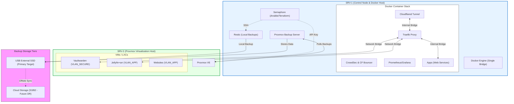

# 🔧 System Implementation Details

This page provides a deep technical dive into the infrastructure configuration, container networking, and automation workflows implemented in the homelab.

---

# 🌐 Technical Architecture Diagram

This diagram maps the physical hardware to the logical networks, showing how data flows between hosts, containers, and backup storage tiers.

---
### 📦 Container Networking & Services

* **Docker Host:** All containers on SRV-1 reside on a single Docker bridge network to simplify internal communication while maintaining container isolation from the host OS.
* **Ingress:** Traffic enters via the Cloudflare Tunnel container and is routed by Traefik.
* **Service Mapping:** Traefik acts as the central gateway, routing traffic to local Docker containers and cross-host services (VMs/LXCs on SRV-2) via defined network bridges.
---
### 🛡️ Automation & Infrastructure as Code (IaC)

* **Proxmox Provisioning:** **Terraform** utilizes the Proxmox API (via API Keys) to programmatically define and deploy virtualized resources.
* **Guest OS Configuration:** **Ansible** handles post-provisioning tasks, managing storage mounts, volume configurations, and OS hardening—tasks that exceed the scope of the Proxmox API permissions.
* **Secrets Management:** Sensitive data is never stored in plain text. **Ansible Vault** encrypts all credentials, which are only decrypted in-memory by Semaphore during deployment.
---
### 💾 Backup & Disaster Recovery (DR) Strategy

The lab employs a tiered backup strategy to ensure data integrity and system availability:

| Source | Tool | Frequency | Destination | Tier |
| :--- | :--- | :--- | :--- | :--- |
| **SRV-1 OS/Configs** | Restic | Daily | Local SSD & USB | Primary |
| **SRV-2 OS/Configs** | Restic | Daily | Local SSD | Primary |
| **VMs & LXCs** | PBS | Scheduled | External USB (via SRV-1) | Secondary |
| **All Critical Data** | Restic/PBS | Weekly | **Cloud (S3/B2)** | **Disaster Recovery** |
---
### Data Resilience Workflow
1.  **Local Tier:** Each server maintains its own OS-level backups for rapid "undo" capability.
2.  **On-Site Tier:** Proxmox Backup Server (PBS) is hosted on SRV-1 and pulls full backups from SRV-2, centralizing them on a high-speed USB SSD.
3.  **Future Off-Site Tier:** To mitigate total site loss, an offsite synchronization task is planned to encrypt and replicate the USB SSD contents to S3-compatible cloud storage (Backblaze B2 or AWS S3).
