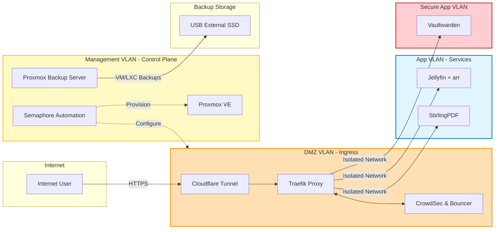

# 🏗️ Homelab Architecture Overview

My homelab is designed as a modular, reproducible platform that mirrors real-world cloud engineering environments. It focuses on automation, security, observability, and clear separation of concerns, optimized for my specific hardware limitations.

The entire infrastructure is managed as code, ensuring that the lab can be redeployed from scratch without manual intervention.

---

# 🧭 Design Principles

* **Modularity** — Services are containerized, isolated, and replaceable.
* **Reproducibility** — Infrastructure is automated with Ansible and Terraform, utilizing declarative configurations.
* **Security-first** — Network segmentation, least-privilege access, and zero-trust tunneling are enforced.
* **Observability** — Comprehensive metrics and logging are enabled across all layers.
* **Resilience** — Automated backup workflows ensure data integrity and disaster recovery.

---

# 🛡️ High-Level Security Architecture

This diagram illustrates the logical separation of concerns and the traffic flow from the internet to the application layer.

---
### 🤖 Automation & Secrets Management

The lab utilizes a robust automation workflow to ensure consistency and security.

* **IaC (Infrastructure as Code):** **Terraform** is used to provision virtual machines and resources on the Proxmox virtualization host.
* **Configuration Management:** **Ansible** manages the OS-level configurations, package installations, and Docker deployments.
* **Automation Platform:** **Semaphore** serves as the central control plane (running on bare metal for resilience), taking over automation tasks after the initial setup.
* **Secrets Management:** All sensitive variables are stored in **Ansible Vaults**. The deployment process uses templates to populate configuration files and environment variables, ensuring no unencrypted secrets are pushed to version control.
---
### 💾 Backup & Disaster Recovery

Data resilience is achieved through a multi-layered backup strategy:

1.  **System Configuration:** **Restic** is automated to back up critical configuration files and secrets to local and external storage.
2.  **Virtual Machines & Containers:** **Proxmox Backup Server (PBS)** manages deduplicated, scheduled backups of all virtual machines and containers to dedicated physical storage.

