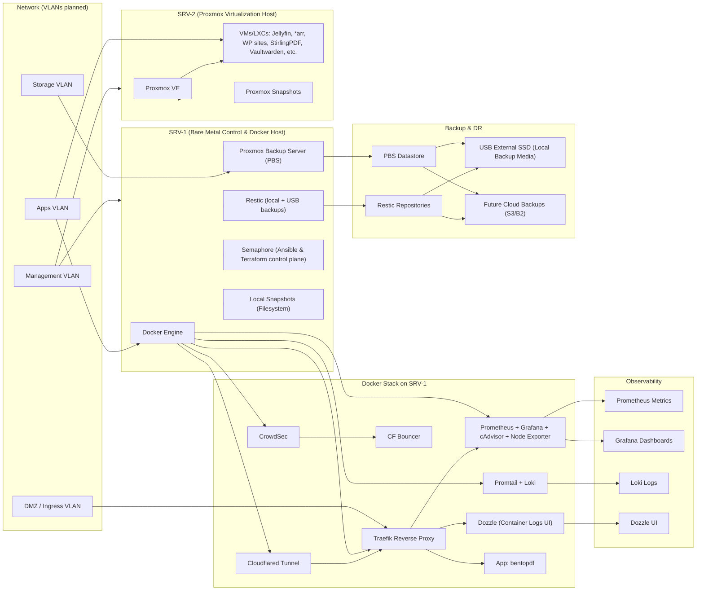

# Homelab Architecture Overview

My homelab is designed as a modular, reproducible platform that mirrors real-world cloud engineering environments.  
It focuses on automation, security, observability, and clear separation of concerns.

This page provides a high-level overview of the core components, design principles, and system layout.

---

# 🧭 Design Principles

- **Modularity** — each service is isolated and replaceable  
- **Reproducibility** — everything is automated with Ansible and declarative configs  
- **Security-first** — network segmentation, least-privilege access, zero-trust tunnels  
- **Observability** — metrics, logs, and monitoring across all layers  
- **Resilience** — backups, snapshots, and disaster recovery workflows  
- **Cloud-aligned** — architecture mirrors AWS/Azure/GCP patterns  

---

# 🏗️ High-Level Architecture Diagram

*A visual diagram will be added here.*

The architecture consists of:

- A Proxmox virtualization layer  
- A Docker application stack  
- A Traefik reverse proxy  
- Cloudflared tunnels for secure external access  
- A segmented network with dedicated VLANs  
- Monitoring and alerting via Prometheus  
- Backup and disaster recovery using Restic and Proxmox Backup Server  

---

# 🖥️ Virtualization Layer (Proxmox)

Proxmox provides the core compute layer for the homelab:

- KVM virtual machines  
- LXC containers  
- Centralized management  
- Snapshots and scheduled backups  
- PCI passthrough where required  

This layer mirrors cloud compute primitives (EC2, Azure VM, GCE).

---

# 🐳 Application Layer (Docker + Compose)

Applications run inside a modular Docker stack:

- Each service defined in its own Compose file  
- Shared networks for internal communication  
- Explicit version pinning  
- Bind mounts for persistent data  
- Automated deployment via Ansible  

This mirrors containerized workloads in ECS, EKS, AKS, and GKE.

---

# 🌐 Networking & Reverse Proxy (Traefik)

Traefik handles:

- Routing  
- TLS termination  
- Automatic certificate management  
- Service discovery  
- Middleware (auth, rate limiting, headers)  

All routing rules are defined declaratively via labels.

---

# 🔐 Zero-Trust Access (Cloudflared)

Cloudflared tunnels provide secure external access without exposing ports:

- No inbound firewall rules  
- Identity-based access  
- Encrypted tunnels  
- Integration with Traefik  

This mirrors zero-trust patterns used in modern cloud environments.

---

# 📡 Network Segmentation

The homelab uses VLANs and firewall rules to isolate workloads:

- **Management network** — Proxmox, PBS  
- **Application network** — Docker services  
- **Storage network** — NFS/SMB  
- **DMZ** — reverse proxy and ingress  
- **IoT/Guest networks** — isolated, restricted  

This enforces least privilege and reduces blast radius.

---

# 📊 Monitoring & Observability (Prometheus)

Monitoring stack includes:

- Prometheus server  
- Node exporters  
- cAdvisor  
- Blackbox exporter  
- Dashboards (Grafana planned)  

This provides visibility into system health, performance, and failures.

---

# 💾 Backup & Disaster Recovery

Two backup systems ensure resilience:

### **Restic**
- Backs up configuration, secrets, and application data  
- Encrypted repositories  
- Automated via systemd timers or Ansible  

### **Proxmox Backup Server**
- VM and container backups  
- Deduplication  
- Scheduled jobs  
- Off-host storage  

This mirrors cloud backup strategies (EBS snapshots, S3 backups, etc.).

---

# ⚙️ Automation (Ansible)

Ansible automates:

- VM provisioning  
- Docker stack deployment  
- Configuration management  
- Backup setup  
- System updates  
- Secrets management (Vault)  

This ensures the entire homelab is reproducible from scratch.

---

# 🚀 Future Improvements

- Add Terraform for infrastructure provisioning  
- Introduce Kubernetes (K3s or Talos)  
- Expand monitoring with Grafana dashboards  
- Implement centralized logging (Loki or ELK)  
- Add CI/CD pipelines for automated deployments  

---

# 📁 Related Pages

- 👉 [Projects](projects.md)  
- 👉 [Documentation](docs.md)  
- 👉 [Home](index.md)  
