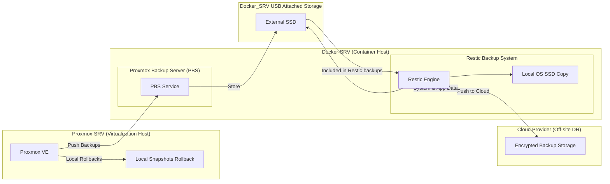

# Backup & Recovery Strategy

This page summarizes the homelab backup and recovery approach: local rollback capability for quick restores, durable local copies for fast recovery, and an encrypted off‑site copy for disaster recovery. The design follows a simple 3‑2‑1 principle: multiple copies, multiple local media, and one off‑site copy.

---

## Strategy Overview

- **Local rollbacks** are provided by Proxmox snapshots for fast VM/LXC recovery.  
- **Primary backup collection** for Proxmox is handled by PBS running on the Docker host and stored on an attached USB SSD.  
- **System and application backups** for the Docker host are performed by Restic; Restic keeps local copies on the OS SSD and the USB SSD, and pushes encrypted backups to cloud storage.  
- **Off‑site resilience** is achieved by Restic pushing encrypted copies to a cloud provider, ensuring recoverability if local media is lost.

---

## Key Principles

- **Separation of roles**: PBS is the Proxmox backup target and stores VM/LXC backups locally; Restic is the general backup engine that creates local copies and is responsible for pushing encrypted backups off‑site.  
- **Multiple local media**: Backups exist on the OS SSD and the USB SSD to protect against single‑device failure.  
- **Encrypted off‑site copy**: Restic pushes encrypted backups to cloud storage to satisfy off‑site recovery requirements.  
- **Recoverability focus**: Snapshots provide quick rollbacks; Restic + PBS provide full restores and off‑site disaster recovery.

---

## Practical Notes (for your runbook)

- Ensure PBS datastore is included in Restic backups so Proxmox backups are recoverable off‑site.  
- Rotate and test restore procedures regularly: snapshot rollback, PBS restore, and full Restic restore from cloud.  
- Keep encryption keys and credentials stored securely and versioned in your secrets store (Vaultwarden is isolated for this purpose).

