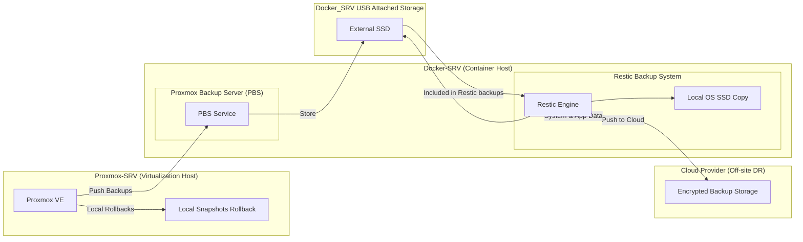

# Backup & Recovery Strategy

**Technical summary**  
A 3‑2‑1 backup approach: local rollback via Proxmox snapshots, durable local backups via Proxmox Backup Server (PBS) and Restic, and an encrypted off‑site copy pushed by Restic to cloud storage. Backups run daily in low‑load hours with retention tuned to balance recoverability and cloud cost.

## At a glance
- **Local rollbacks:** Proxmox snapshots for fast VM/LXC recovery.  
- **Primary local backups:** PBS on Docker‑SRV stores Proxmox backups to an attached USB SSD.  
- **System and app backups:** Restic keeps copies on the OS SSD and the USB SSD, and pushes encrypted backups off‑site.  
- **Off‑site DR:** Restic uploads encrypted snapshots to cloud storage for disaster recovery.

## Diagram explanation
1. **Proxmox snapshots** provide immediate rollback capability for VMs and containers.  
2. **Proxmox to PBS:** Proxmox pushes backups to the PBS service running on Docker‑SRV; PBS stores them on the attached USB SSD.  
3. **Restic backups:** Restic backs up system and application data to the local OS SSD and the USB SSD; it includes the PBS datastore so Proxmox backups are captured off‑site.  
4. **USB SSD role:** Acts as PBS storage and a Restic local copy location; Restic also backs up the USB SSD contents.  
5. **Restic to cloud:** Restic pushes encrypted backups to cloud storage for off‑site resilience.

## Schedule and retention (single‑operator homelab)
- **Operator:** Single maintainer (you). Keep encryption keys and credentials in Vaultwarden.  
- **Backup schedule:** Daily backups run in the early hours when load is low. Cloud uploads occur **once per week**.  
- **Retention policy:**  
  - **Daily:** retain **5** daily backups.  
  - **Weekly:** retain **3** weekly backups.  
  - **Monthly:** retain **2** monthly backups.  
  - **Cloud:** retain **up to 4** weekly cloud backups to control storage costs.

## Runbook bullets
- **Daily (automated):** Run backups in early hours; verify job success; check Restic and PBS logs; confirm USB SSD health.  
- **Weekly:** Perform cloud upload; verify integrity of one cloud snapshot; rotate any short‑term credentials if needed.  
- **Monthly:** Perform a partial or full restore test from cloud to validate keys and procedures.  
- **Restore types to practice:** snapshot rollback (fast); PBS restore (local full VM/LXC); full Restic restore from cloud (DR scenario).  
- **Secrets and keys:** Store encryption keys and cloud credentials in Vaultwarden; rotate and version them during monthly maintenance.  
- **Monitoring and alerts:** Alert on backup failures, storage fill thresholds, and snapshot age exceeding retention windows.

## Recommendations
- **Include PBS datastore in Restic scope** so Proxmox backups are recoverable off‑site.  
- **Document RTO/RPO targets** (suggested: snapshot rollback RTO in minutes; PBS local restore RTO in hours; cloud full restore RTO 24+ hours). I can formalize these if you want.  
- **Test cadence:** weekly quick restores, monthly full restores, quarterly DR tabletop exercises.

**Next page:** https://richpea1982.github.io/edge-networking.html
