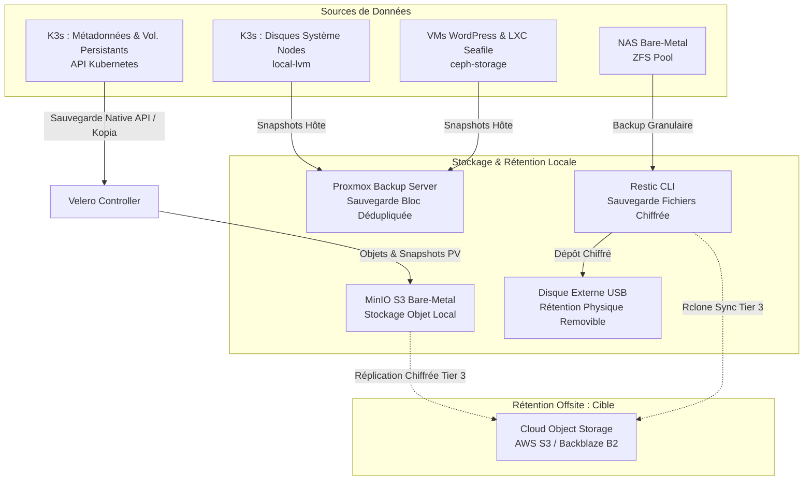

# Stratégie de Sauvegarde & Résilience

Cette page détaille la politique de protection des données et de reprise après sinistre (Disaster Recovery) mise en œuvre sur l'infrastructure. L'architecture combine des sauvegardes au niveau infrastructure (bloc) et au niveau applicatif (orchestrateur) pour respecter une **règle du 3-2-1** stricte.

---

## 📊 Flux de Sauvegarde Multi-Niveaux

Le schéma suivant illustre la cinématique de sauvegarde, mettant en évidence l'intégration de Velero pour la couche Kubernetes et de Restic/PBS pour le reste de l'infrastructure :

```mermaid
graph TD
    subgraph Sources [Sources de Données]
        K3s_API[K3s : Métadonnées & Vol. Persistants<br>API Kubernetes]
        K3s_VM[K3s : Disques Système Nodes<br>local-lvm]
        Stateful[VMs WordPress & LXC Seafile<br>ceph-storage]
        NAS_Files[NAS Bare-Metal<br>ZFS Pool]
    end

    subgraph Target_Local [Stockage & Rétention Locale]
        MinIO[MinIO S3 Bare-Metal<br>Stockage Objet Local]
        PBS[Proxmox Backup Server<br>Sauvegarde Bloc Dédupliquée]
        Restic[Restic CLI<br>Sauvegarde Fichiers Chiffrée]
        USB[Disque Externe USB<br>Rétention Physique Removible]
    end

    subgraph Target_Cloud [Rétention Offsite : Cible]
        S3[Cloud Object Storage<br>AWS S3 / Backblaze B2]
    end

    K3s_API -->|Sauvegarde Native API / Kopia| Velero[Velero Controller]
    Velero -->|Objets & Snapshots PV| MinIO
    K3s_VM -->|Snapshots Hôte| PBS
    Stateful -->|Snapshots Hôte| PBS
    NAS_Files -->|Backup Granulaire| Restic
    Restic -->|Dépôt Chiffré| USB
    MinIO -.->|Réplication Chiffrée Tier 3| S3
    Restic -.->|Rclone Sync Tier 3| S3
```

---

## 🛠️ Implémentation Technique des Outils de Sauvegarde

### 1. Sauvegarde Applicative Kubernetes (Velero)
Dédié à la capture de l'état logique interne du cluster K3s et de ses données persistantes.
* **Fonctionnement** : Déployé comme un opérateur au sein du cluster, **Velero** interroge l'API Kubernetes pour sauvegarder les manifests (CRDs, Secrets, ConfigMaps, Ingress) et orchestre la capture des volumes persistants (PV) via son plug-in de snapshot natif (ou intégration Kopia/Restic).
* **Destination** : Les sauvegardes sont poussées directement vers un compartiment dédié sur l'instance **MinIO S3** s'exécutant sur le NAS Bare-Metal.
* **Avantage Clé** : Permet une restauration granulaire au niveau de l'orchestrateur (ex: restaurer un seul namespace ou annuler un déploiement corrompu) sans avoir à restaurer l'intégralité de la VM sous-jacente.

### 2. Sauvegarde Niveau Bloc (Proxmox Backup Server)
Dédié à la restauration rapide et complète de l'enveloppe matérielle virtuelle.
* **Fonctionnement** : La VM spécialisée `PBS` (sur `pve1`) effectue des snapshots incrémentaux au niveau bloc avec déduplication globale.
* **Périmètre** : 
    * OS et disques système des nœuds K3s (`2021-2023`) situés sur le datastore `local-lvm`.
    * Instances d'applications étatiques hors-K3s (`hantaweb`, `petitsanglais`, `Seafile`) s'exécutant sur le pool répliqué `ceph-storage`.

### 3. Sauvegarde Fichiers (Restic CLI)
Dédié à la capture granulaire des données du stockage de masse non conteneurisé.
* **Fonctionnement** : Restic sauvegarde, déduplique et chiffre les données côté client au niveau du système de fichiers du NAS Bare-Metal et des volumes lourds montés par les LXCs (Jellyfin, Photoprism).
* **Destination** : Poussé vers un espace de stockage local, puis dupliqué sur un disque externe USB amovible.

---

## 🎯 Architecture Cible (Tier 3) : Évacuation Cloud Étanche

Pour parer aux sinistres physiques (incendie, vol, dégât des eaux), la couche de stockage objet locale (MinIO) et les dépôts Restic locaux feront l'objet d'une réplication externe automatisée.

* **Technologie** : Synchronisation différentielle programmée via les politiques de réplication native de MinIO ou via `rclone`.
* **Cible** : Un compartiment de stockage objet chiffré chez **Backblaze B2** ou **AWS S3** (classe Infrequent Access).
* **Sécurité** : Les données sont chiffrées avant transfert avec des clés gérées localement. Le fournisseur cloud n'a aucune visibilité sur le contenu des sauvegardes.

---

## ⏱️ Planification & Rétention

| Composant / Outil | Fréquence | Cible de Stockage | Rétention (Prune) |
| :--- | :--- | :--- | :--- |
| **Velero (K3s Apps & PVs)** | Quotidien (01:00) | MinIO S3 (NAS) | `7 jours` |
| **PBS (Snapshots VMs)** | Quotidien (02:00) | Datastore PBS (`pve1`) | `keep-last=7, weekly=4, monthly=12` |
| **Restic (Données NAS)** | Quotidien (04:00) | SSD Local + USB | `keep-daily=7, weekly=4, monthly=6` |
| **Réplication Cloud (Cible)**| Hebdomadaire | Backblaze B2 / AWS S3 | Identique à la rétention locale |

---

* **[Suivant : Rétrospective Technique & Leçons Apprises →](/lessons-learned.html)**
* **[← Accueil](/index.html)**

---
