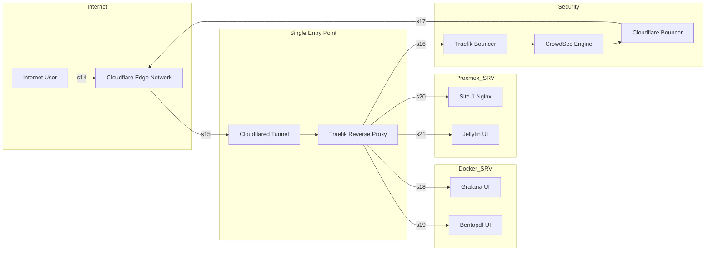

# Edge Networking & Security

This section provides a high‑level overview of how external traffic enters the homelab, how it is authenticated and filtered, and how services remain protected behind a zero‑trust ingress layer. The goal is to expose applications securely without opening any ports to the public internet.

---

## Ingress Flow Overview

Incoming requests are routed through Cloudflare’s global edge network before reaching the homelab. A Cloudflare Tunnel provides a secure, outbound‑only connection to the internal reverse proxy, ensuring that no inbound ports are exposed. Traefik receives all tunneled traffic and performs domain‑based routing, TLS enforcement, and service‑level access control. Backend services remain isolated and are never exposed directly.

---

## Zero‑Trust Ingress

The homelab uses a zero‑trust ingress model built around Cloudflare Tunnel. All inbound traffic is terminated at Cloudflare’s edge, inspected, and only then forwarded through an encrypted outbound tunnel to the internal reverse proxy. This eliminates the need for port forwarding and ensures that no services are directly reachable from the public internet.

Traefik handles routing and TLS enforcement, ensuring that only approved domains and services are accessible.

---

## Security Enforcement

CrowdSec provides an additional security layer by analyzing traffic patterns and applying community‑driven threat intelligence. Two bouncers enforce decisions at different layers:

- **Traefik Bouncer** applies local decisions at the reverse proxy  
- **Cloudflare Bouncer** updates Cloudflare’s firewall using an API token  

This dual‑layer approach blocks malicious traffic both at the edge and inside the homelab, reducing the attack surface and preventing repeated abuse.

---

## Service Isolation

Only frontend interfaces are reachable through Traefik. Backend components, internal APIs, and system services remain isolated behind Docker networks or Proxmox VLANs. This ensures that even if a public‑facing service is compromised, internal systems remain protected.
