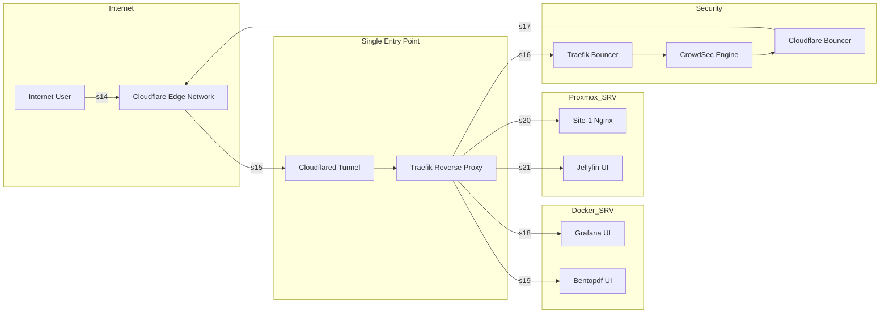

# Edge Networking & Security

**Technical summary**  
A zero‑trust ingress model routes all external traffic through Cloudflare’s global edge and an outbound Cloudflare Tunnel into a single internal reverse proxy (Traefik). This removes the need for inbound port forwarding while enabling domain‑based routing, TLS enforcement, and layered threat mitigation.

## At a glance
- **Single external entry:** Cloudflare Edge → Cloudflare Tunnel → Traefik.  
- **Zero‑trust:** No direct inbound ports; Cloudflare inspects and forwards only approved traffic.  
- **Layered enforcement:** Traefik enforces routing and TLS; CrowdSec analyzes traffic; two bouncers apply decisions locally and at Cloudflare.  
- **Service isolation:** Only frontend UIs are reachable via Traefik; backend services remain on isolated Docker networks or Proxmox VLANs.

## Diagram explanation
1. **Internet user to Cloudflare Edge.** Cloudflare terminates TLS, applies edge rules, and performs initial filtering.  
2. **Cloudflare Edge to Cloudflared Tunnel.** Traffic is forwarded over an outbound, encrypted tunnel to your homelab—no inbound ports required.  
3. **Cloudflared Tunnel to Traefik.** Traefik is the single internal ingress point that performs domain routing, TLS termination, and middleware enforcement.  
4. **Security decision flow.** Traefik Bouncer applies local rules; CrowdSec evaluates traffic patterns; Cloudflare Bouncer updates edge firewall rules to block repeat offenders.  
5. **Traefik to frontend services.** Only approved frontends (e.g., Grafana, Bentopdf, Jellyfin, websites) are routed; backend components remain unreachable unless explicitly routed.

## Operational notes
- **Authentication and TLS:** Use automated certificate management and enforce strong TLS ciphers.  
- **Access control:** Apply service‑level access rules in Cloudflare and Traefik middleware for admin UIs.  
- **Monitoring:** Track tunnel health, Traefik routing errors, CrowdSec decisions, and Cloudflare firewall changes.  
- **Incident response:** Block malicious IPs at Cloudflare first via the Cloudflare Bouncer, then isolate or take down affected services locally.

## Security enforcement summary
- **CrowdSec** provides community threat intelligence and behavioral detection.  
- **Traefik Bouncer** enforces immediate local decisions.  
- **Cloudflare Bouncer** pushes persistent blocks to the edge to reduce repeated abuse.

**Next page:** https://richpea1982.github.io/internal-networking.html

