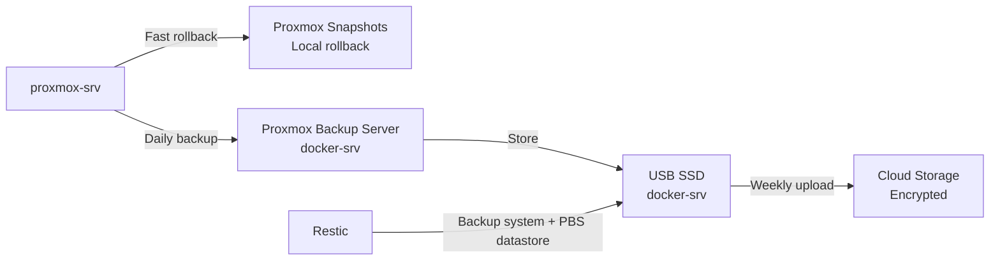

  <a href="/fr/backup-strategy.html">🇫🇷 Français</a>

# Backup & Recovery

**Technical summary**
A 3-2-1 backup strategy: local rollback via Proxmox snapshots, 
durable local backups via Proxmox Backup Server (PBS) and Restic, 
and encrypted off-site copies pushed by Restic to cloud storage.

---

## Strategy overview

| Copy | Technology | Location |
|------|------------|----------|
| 1st — Local rollback | Proxmox snapshots | proxmox-srv local storage |
| 2nd — Local durable | PBS + Restic | USB SSD on docker-srv |
| 3rd — Off-site DR | Restic | Cloud storage (encrypted) |

---

## Schedule and retention

| Frequency | Action | Retention |
|-----------|--------|-----------|
| Daily | Proxmox backup to PBS | 5 daily |
| Daily | Restic backup to USB SSD | 5 daily |
| Weekly | Restic upload to cloud | 4 weekly |
| Monthly | Manual restore test | — |

Backups run in early hours during low load. Cloud uploads run 
once per week to control storage costs.

---

## Recovery scenarios

| Scenario | Method | RTO |
|----------|--------|-----|
| Accidental config change | Proxmox snapshot rollback | Minutes |
| VM or LXC failure | PBS restore from USB SSD | Hours |
| Full hardware loss | Restic restore from cloud | 24+ hours |

---

## Secrets and keys

Encryption keys and cloud credentials are stored in Ansible Vault. 
Key rotation is performed during monthly maintenance. Without the 
vault password, off-site backups cannot be decrypted — the vault 
password is stored separately from the backup credentials themselves.

---

## Planned improvements

- Automated restore testing via Ansible
- Alerting on backup job failure
- Monitoring of USB SSD health and storage fill level

---

[← Security](/en/security.html) | [← Home](/en/index.html)
