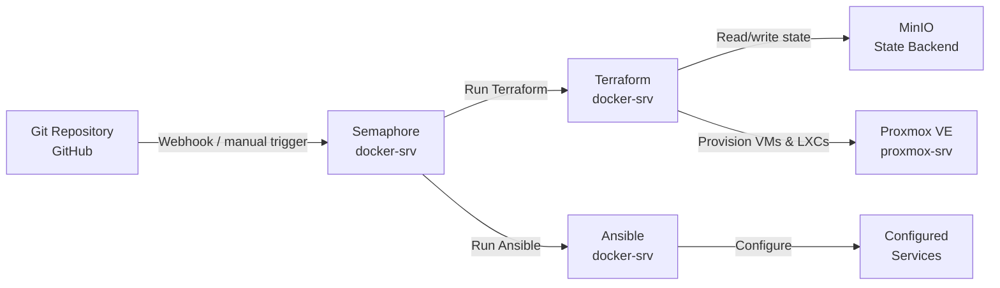

<div style="text-align: right">
  <a href="/fr/iac-automation.html">🇫🇷 Français</a>
</div>

# IaC & Automation

**Technical summary**
All infrastructure is defined as code and executed through an automated 
pipeline. Terraform provisions Proxmox VMs and LXCs with state stored 
in a self-hosted MinIO S3 backend. Ansible configures every service 
through reusable roles, executed by Semaphore as a self-hosted CI/CD 
platform. No infrastructure is created or modified by hand.

---

## Pipeline overview


---

## Terraform

Terraform provisions all infrastructure on Proxmox using the 
community `bpg/proxmox` provider. State is stored remotely in MinIO, 
a self-hosted S3-compatible object store, so state persists across 
Semaphore task runs and is never lost when the workspace is cleaned.

### Provider and backend
```hcl
terraform {
  required_version = ">= 1.6.0"

  backend "s3" {
    bucket   = "terraform-state"
    key      = "homelab/terraform.tfstate"
    endpoints = {
      s3 = "http://docker-srv:9000"
    }
    use_path_style              = true
    skip_credentials_validation = true
    skip_metadata_api_check     = true
    skip_region_validation      = true
    skip_requesting_account_id  = true
  }

  required_providers {
    proxmox = {
      source  = "bpg/proxmox"
      version = "0.94.0"
    }
  }
}
```

### Reusable modules

Rather than repeating resource blocks, infrastructure is defined once 
as a module and called with different variables per instance. The 
WordPress LXC module is a good example — one module definition 
provisions all four WordPress containers:
```hcl
module "richweb" {
  source   = "./modules/wp-lxc"
  hostname = "richweb"
  vmid     = 210
  ip       = "10.20.0.10"
}

module "petitsanglais" {
  source   = "./modules/wp-lxc"
  hostname = "petitsanglais"
  vmid     = 211
  ip       = "10.20.0.11"
}
```

The module itself defines the LXC resource once with variables for 
everything that differs between instances — hostname, IP, VMID, 
resources, and template. Adding a new WordPress site requires only 
a new module call, not a new resource block.

### VyOS router VM

The VyOS router VM is also fully defined in Terraform with fixed MAC 
addresses to prevent network reconfiguration on re-apply, and a 
lifecycle block to prevent Terraform from modifying boot order or 
CDROM settings after initial provisioning:
```hcl
lifecycle {
  ignore_changes = [
    cdrom,
    boot_order,
    agent,
  ]
}
```

---

## Ansible

Ansible configures every service through modular, reusable roles. 
Variables are separated by concern into group_vars files, with 
sensitive values encrypted using Ansible Vault.

### Role structure
```
ansible/
├── group_vars/
│   └── all/
│       ├── domains.yml       # All domain names
│       ├── services.yml      # Docker service definitions
│       ├── wp-services.yml   # WordPress site definitions
│       ├── vault.yml         # Encrypted secrets
│       └── wp-vault.yml      # Encrypted WP secrets
├── inventories/
│   └── production/
│       └── hosts.yml         # All managed hosts
├── playbooks/
│   ├── common.yml
│   ├── router.yml
│   ├── wordpress.yml
│   └── traefik.yml
└── roles/
    ├── common/               # Base packages, SSH, users
    ├── vyos-router/          # VyOS NAT and VLAN config
    ├── wp-fullstack/         # nginx, PHP-FPM, MariaDB, WordPress
    ├── traefik/              # Traefik + dynamic config
    ├── cloudflared/          # Cloudflare tunnel config
    ├── minio/                # MinIO object storage
    └── monitoring/           # Prometheus, Grafana, Loki
```

### WordPress role

The WordPress role is a good example of the pattern used throughout. 
A single role configures a complete stack — nginx, PHP-FPM, MariaDB, 
and WordPress — driven entirely by variables. The same role runs 
against all four WordPress LXCs, using `inventory_hostname` to look 
up the correct site configuration:
```yaml
- name: Set site variables
  ansible.builtin.set_fact:
    site: "{{ wordpress_sites[inventory_hostname] }}"
```

Site configuration is defined once in `wp-services.yml`:
```yaml
wordpress_sites:
  richweb:
    domain: "{{ richweb_domain }}"
    db_name: richweb
    db_user: richweb
    db_password: "{{ wp_db_passwords.richweb }}"
    ip: "10.20.0.10"
```

### VyOS role

Network devices are configured using the `vyos.vyos` collection with 
`network_cli` connection type. The VyOS role configures NAT masquerade 
and all four VLAN sub-interfaces idempotently:
```yaml
- name: Configure NAT masquerade for all VLANs
  vyos.vyos.vyos_config:
    lines:
      - set nat source rule 100 outbound-interface name eth0
      - set nat source rule 100 source address 10.0.0.0/8
      - set nat source rule 100 translation address masquerade
    save: true
```

### Secrets management

All sensitive values — API tokens, database passwords, WordPress 
salts, Cloudflare credentials — are stored in Ansible Vault encrypted 
files committed to the Git repository. Semaphore holds only the vault 
password as an environment secret, never the secrets themselves.

---

## Semaphore

Semaphore is a self-hosted web UI and API for running Ansible and 
Terraform tasks. It provides:

- **Task templates** — predefined playbook runs with associated 
inventory, credentials, and environment variables
- **Audit trail** — full logs of every task run with timestamps
- **Vault integration** — vault passwords stored as Semaphore secrets, 
injected at runtime
- **Scheduled tasks** — future use for automated maintenance runs

Each infrastructure component has its own Semaphore template:

| Template | Tool | Purpose |
|----------|------|---------|
| Provision infrastructure | Terraform | Create/update VMs and LXCs |
| Configure common | Ansible | Base configuration all hosts |
| Configure VyOS router | Ansible | NAT and VLAN configuration |
| Deploy WordPress | Ansible | Full WordPress stack per site |
| Deploy Traefik | Ansible | Ingress and routing config |
| Deploy monitoring | Ansible | Prometheus, Grafana, Loki |

---

## MinIO

MinIO provides S3-compatible object storage for Terraform state. 
Running on docker-srv, it gives Terraform a persistent, versioned 
state backend without requiring an AWS account. The same MinIO 
instance can be extended to store application backups and artefacts 
in future.

---

[← Infrastructure Overview](/en/infrastructure.html) | 
**[Next: Network Architecture →](/en/networking.html)**
