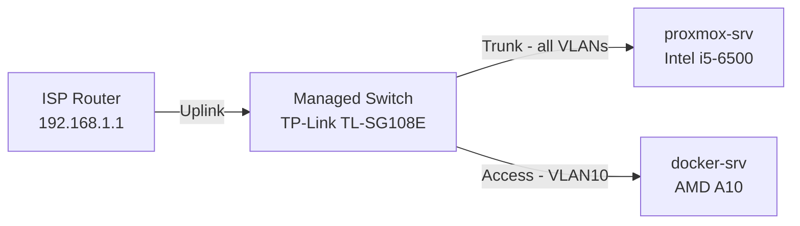
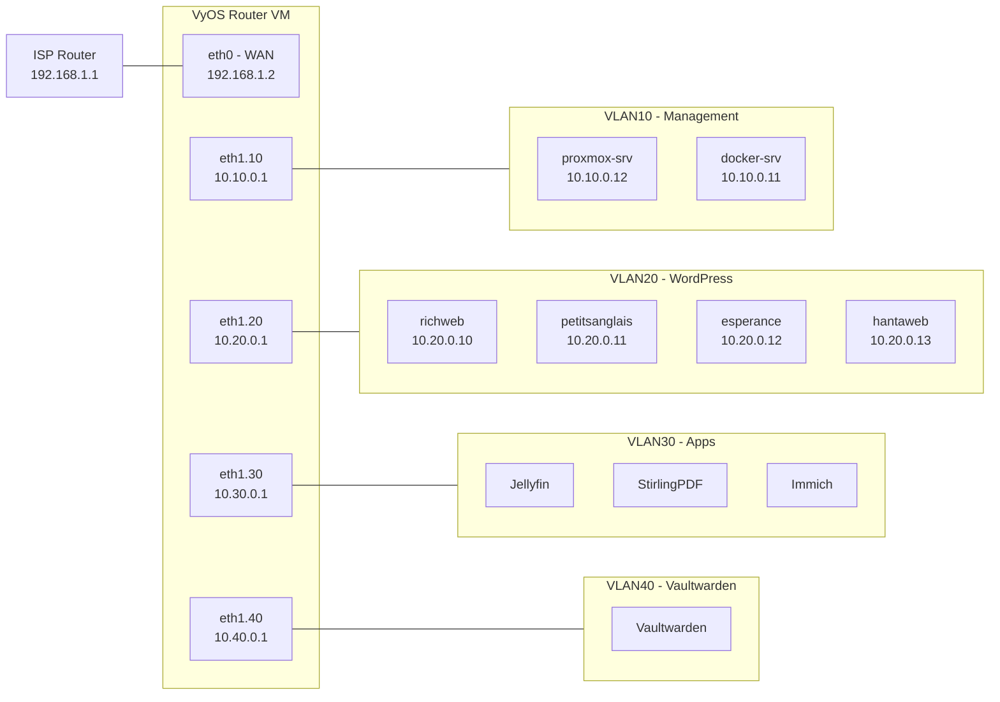
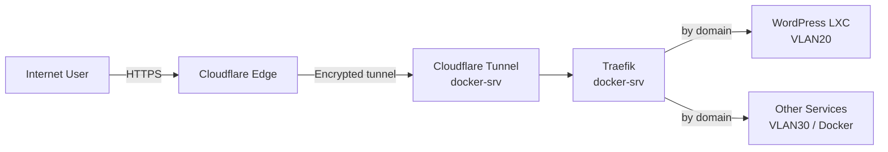

  <a href="/fr/infrastructure.html">🇫🇷 Français</a>

# Infrastructure Overview

**Technical summary**
Two physical servers connected via a managed switch, with a VyOS router 
VM handling all internal routing and VLAN segmentation. All 
infrastructure is provisioned by Terraform and configured by Ansible 
with minimal manual intervention.

---

## Physical layout

| Device | Role | Connection |
|--------|------|------------|
| ISP Router | Internet uplink + WiFi | — |
| TP-Link TL-SG108E | Managed switch | Uplink to ISP router |
| proxmox-srv | Virtualisation host | Trunk port (all VLANs) |
| docker-srv | Container host | Access port (VLAN10) |

---

## Network topology

Traffic from all four VLANs is routed by a VyOS VM running on 
proxmox-srv. VyOS handles inter-VLAN routing and NAT, presenting 
a single WAN interface to the ISP router.

| VLAN | Subnet | Purpose |
|------|--------|---------|
| VLAN10 | 10.10.0.0/24 | Management — proxmox-srv, docker-srv |
| VLAN20 | 10.20.0.0/24 | WordPress — LXC containers |
| VLAN30 | 10.30.0.0/24 | Apps — Jellyfin, StirlingPDF, Immich |
| VLAN40 | 10.40.0.0/24 | Vaultwarden — isolated secrets manager |

---

## Traffic flow

All external traffic enters through Cloudflare — no inbound ports 
are open on the ISP router. The Cloudflare tunnel runs on docker-srv 
and forwards traffic to Traefik, which routes to the appropriate 
service by domain name.

---

## Full stack summary

| Layer | Technology | Where it runs |
|-------|------------|---------------|
| Physical network | TP-Link TL-SG108E | Hardware |
| Routing & NAT | VyOS | VM on proxmox-srv |
| Virtualisation | Proxmox VE | proxmox-srv |
| Containers | Docker | docker-srv |
| LXC workloads | Debian 13 LXCs | proxmox-srv |
| Provisioning | Terraform | docker-srv (CLI) |
| Configuration | Ansible + Semaphore | docker-srv |
| State backend | MinIO | docker-srv |
| Ingress | Cloudflare Tunnel + Traefik | docker-srv |
| Security | CrowdSec + Bouncer | docker-srv |
| Monitoring | Prometheus + Grafana + Loki | docker-srv |
| Secrets | Ansible Vault | Git repo (encrypted) |

---

*This overview reflects the current state of the homelab. 
Pages below cover each layer in detail.*

---

[← Home](/en/index.html) | **[Next: IaC & Automation →](/en/iac-automation.html)**
