  <a href="/fr/networking.html">🇫🇷 Français</a>

# Network Architecture

**Technical summary**
A VyOS router VM handles all internal routing and NAT between four 
isolated VLANs. External traffic enters exclusively via a Cloudflare 
Tunnel — no inbound ports are open on the ISP router.

---

## Zero-trust ingress

No ports are forwarded on the ISP router. The homelab's public IP 
is never exposed. All traffic passes through Cloudflare's global 
threat intelligence before reaching the home network.

---

## VLAN segmentation

| VLAN | Subnet | Purpose |
|------|--------|---------|
| VLAN10 | 10.10.0.0/24 | Management |
| VLAN20 | 10.20.0.0/24 | WordPress LXCs |
| VLAN30 | 10.30.0.0/24 | Applications |
| VLAN40 | 10.40.0.0/24 | Vaultwarden — isolated |

```mermaid
flowchart TD
    VYOS[VyOS Router VM]

    subgraph VLAN10["VLAN10 — Management"]
        PVE[proxmox-srv 10.10.0.12]
        DOCK[docker-srv 10.10.0.11]
    end

    subgraph VLAN20["VLAN20 — WordPress"]
        WP1[richweb 10.20.0.10]
        WP2[petitsanglais 10.20.0.11]
        WP3[esperance 10.20.0.12]
        WP4[hantaweb 10.20.0.13]
    end

    subgraph VLAN30["VLAN30 — Apps"]
        APP[Jellyfin / StirlingPDF / Immich]
    end

    subgraph VLAN40["VLAN40 — Vaultwarden"]
        VW[Vaultwarden]
    end

    VYOS --- VLAN10
    VYOS --- VLAN20
    VYOS --- VLAN30
    VYOS --- VLAN40
```

WordPress sites are the most likely attack vector — public-facing PHP 
with third-party plugins. Placing them on VLAN20 means a compromised 
site cannot reach management infrastructure or Vaultwarden without 
passing through VyOS firewall rules.

---

## Managed switch

| Port | Mode | Assignment |
|------|------|------------|
| Port 1 | Uplink | ISP router (untagged) |
| Port 2 | Trunk | proxmox-srv (all VLANs tagged) |
| Port 3 | Access | docker-srv (VLAN10 untagged) |

---

## Planned improvements

- Inter-VLAN firewall rules on VyOS
- DHCP server per VLAN on VyOS

---

[← IaC & Automation](/en/iac-automation.html) | 
**[Next: Services & Workloads →](/en/services.html)**
