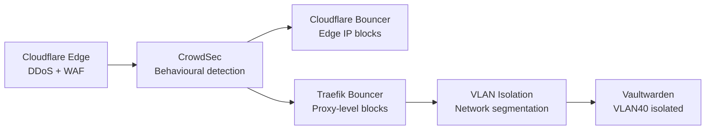

  <a href="/fr/security.html">🇫🇷 Français</a>

# Security

**Technical summary**
Security is applied in layers — at the network edge, at the reverse 
proxy, and at the network segment level. No single layer is relied 
upon exclusively. Sensitive credentials are encrypted at rest and 
never stored in plaintext.

---

## Threat model

| Threat | Mitigation |
|--------|------------|
| External port scanning | No open ports — Cloudflare tunnel only |
| DDoS | Cloudflare edge absorption |
| Brute force / credential stuffing | CrowdSec detection + edge blocking |
| Compromised WordPress plugin | VLAN isolation — cannot reach management or secrets |
| Secrets exposure | Ansible Vault encryption — never plaintext in repo |
| Lateral movement | Inter-VLAN routing requires explicit firewall rules |

---

## Defence layers

**Layer 1 — Cloudflare edge**
TLS termination, DDoS protection, and WAF rules applied before 
traffic reaches the homelab.

**Layer 2 — CrowdSec**
Analyses Traefik access logs for behavioural threats. Decisions 
pushed to two bouncers simultaneously — Cloudflare bouncer blocks 
at the edge, Traefik bouncer blocks at the proxy.

**Layer 3 — VLAN segmentation**
Services are isolated by function. A compromise on VLAN20 
(WordPress) cannot reach VLAN10 (management) or VLAN40 
(Vaultwarden) without passing through VyOS.

**Layer 4 — Vaultwarden isolation**
Password vault data sits on the most restricted VLAN with no 
lateral access from other segments.

---

## Secrets management

All sensitive values are managed through Ansible Vault:

| Secret type | Storage |
|-------------|---------|
| API tokens | Ansible Vault — vault.yml |
| Database passwords | Ansible Vault — wp-vault.yml |
| WordPress salts | Ansible Vault — wp-vault.yml |
| Cloudflare credentials | Ansible Vault — vault.yml |
| Vault password | Semaphore environment secret |

The vault password itself is stored only in Semaphore as an 
environment variable, injected at runtime. It is never written 
to disk or committed to the repository. Encrypted vault files 
are safe to commit to a public Git repository.

---

## Planned improvements

- Explicit inter-VLAN firewall rules on VyOS
- Fail2ban or equivalent on WordPress LXCs
- SSH hardening role applied to all hosts
- Regular automated vulnerability scanning

---

[← Services & Workloads](/en/services.html) | 
**[Next: Backup & Recovery →](/en/backup-strategy.html)**
