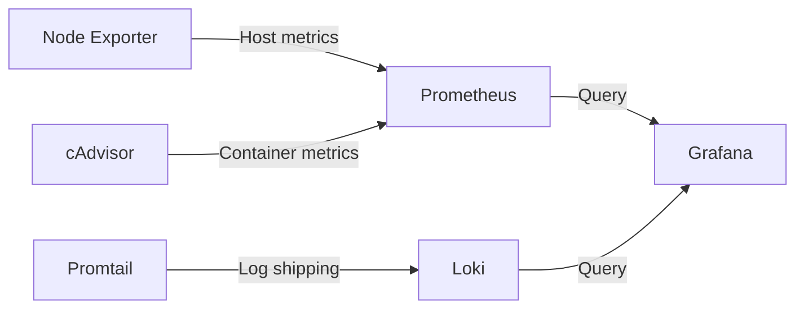

  <a href="/fr/services.html">🇫🇷 Français</a>

# Services & Workloads

**Technical summary**
Services are split across two hosts by workload type. Docker containers 
run on docker-srv for stateless and monitoring workloads. Proxmox LXCs 
on proxmox-srv host WordPress sites and future application workloads, 
each isolated in their own VLAN.

---

## Service map

| Service | Host | Type | VLAN |
|---------|------|------|------|
| Traefik | docker-srv | Docker | — |
| Cloudflared | docker-srv | Docker | — |
| CrowdSec | docker-srv | Docker | — |
| Prometheus | docker-srv | Docker | — |
| Grafana | docker-srv | Docker | — |
| Loki + Promtail | docker-srv | Docker | — |
| MinIO | docker-srv | Docker | — |
| Semaphore | docker-srv | Docker | — |
| Vaultwarden | proxmox-srv | LXC | VLAN40 |
| richweb | proxmox-srv | LXC | VLAN20 |
| petitsanglais | proxmox-srv | LXC | VLAN20 |
| esperance | proxmox-srv | LXC | VLAN20 |
| hantaweb | proxmox-srv | LXC | VLAN20 |
| Jellyfin | proxmox-srv | LXC | VLAN30 |
| StirlingPDF | proxmox-srv | LXC | VLAN30 |
| Immich | proxmox-srv | LXC | VLAN30 |

---

## WordPress sites

Four production WordPress sites, each running as an independent 
Debian 13 LXC with a full stack — nginx, PHP 8.4-FPM, and MariaDB. 
Provisioned by Terraform, configured by a single reusable Ansible role.

| Site | Domain | VLAN |
|------|--------|------|
| richweb | richard.pearsalls.fr | VLAN20 |
| petitsanglais | petitsanglaisabeziers.fr | VLAN20 |
| esperance | egliseesperanceagde.org | VLAN20 |
| hantaweb | hartkenci-elle.com | VLAN20 |

Each LXC is fully isolated — a problem with one site has no impact 
on the others. Traefik on docker-srv routes to each LXC by domain 
name over the internal VLAN20 network.

---

## Observability stack

A full observability stack runs on docker-srv providing metrics, 
logs, and dashboards across all services.

| Component | Purpose |
|-----------|---------|
| Prometheus | Metrics collection and storage |
| Node Exporter | Host-level metrics (CPU, RAM, disk) |
| cAdvisor | Container-level metrics |
| Grafana | Dashboards and visualisation |
| Loki | Log aggregation |
| Promtail | Log shipping from all hosts |

---

## Vaultwarden

Self-hosted password manager running as a Bitwarden-compatible 
server. Isolated on VLAN40 — the most restricted network segment. 
Accessible via Traefik over the Cloudflare tunnel with no direct 
exposure.

---

## Planned workloads

| Service | Purpose | VLAN |
|---------|---------|------|
| Jellyfin | Media server | VLAN30 |
| *arr stack | Automated media acquisition | VLAN30 |
| StirlingPDF | PDF tooling | VLAN30 |
| Immich | Photo management | VLAN30 |

---

[← Network Architecture](/en/networking.html) | 
**[Next: Security →](/en/security.html)**
