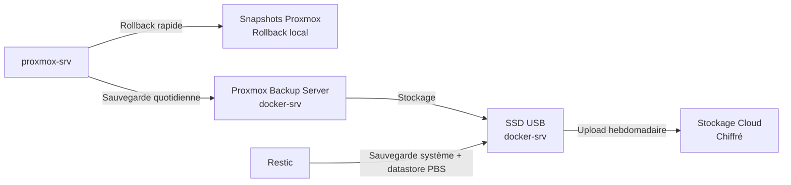

  <a href="/en/backup-strategy.html">🇬🇧 English</a>

# Sauvegarde & Reprise

**Résumé technique**
Une stratégie de sauvegarde 3-2-1 : rollback local via les snapshots 
Proxmox, sauvegardes locales durables via Proxmox Backup Server (PBS) 
et Restic, et copies chiffrées hors site poussées par Restic vers 
le cloud.

---

## Vue d'ensemble de la stratégie

| Copie | Technologie | Emplacement |
|-------|-------------|-------------|
| 1ère — Rollback local | Snapshots Proxmox | Stockage local proxmox-srv |
| 2ème — Durable local | PBS + Restic | SSD USB sur docker-srv |
| 3ème — DR hors site | Restic | Cloud (chiffré) |

---

## Planning et rétention

| Fréquence | Action | Rétention |
|-----------|--------|-----------|
| Quotidien | Sauvegarde Proxmox vers PBS | 5 quotidiennes |
| Quotidien | Sauvegarde Restic vers SSD USB | 5 quotidiennes |
| Hebdomadaire | Upload Restic vers cloud | 4 hebdomadaires |
| Mensuel | Test de restauration manuel | — |

Les sauvegardes tournent en début de nuit pendant les heures creuses. 
Les uploads cloud ont lieu une fois par semaine pour maîtriser les 
coûts de stockage.

---

## Scénarios de reprise

| Scénario | Méthode | RTO |
|----------|---------|-----|
| Changement de config accidentel | Rollback snapshot Proxmox | Minutes |
| Défaillance VM ou LXC | Restauration PBS depuis SSD USB | Heures |
| Perte matérielle complète | Restauration Restic depuis cloud | 24h+ |

---

## Secrets et clés

Les clés de chiffrement et credentials cloud sont stockés dans 
Ansible Vault. La rotation des clés est effectuée lors de la 
maintenance mensuelle. Sans le mot de passe du vault, les sauvegardes 
hors site ne peuvent pas être déchiffrées — le mot de passe du vault 
est stocké séparément des credentials de sauvegarde eux-mêmes.

---

## Améliorations prévues

- Tests de restauration automatisés via Ansible
- Alertes sur les échecs de jobs de sauvegarde
- Monitoring de la santé du SSD USB et du niveau de remplissage

---

[← Sécurité](/fr/security.html) | [← Accueil](/fr/index.html)
