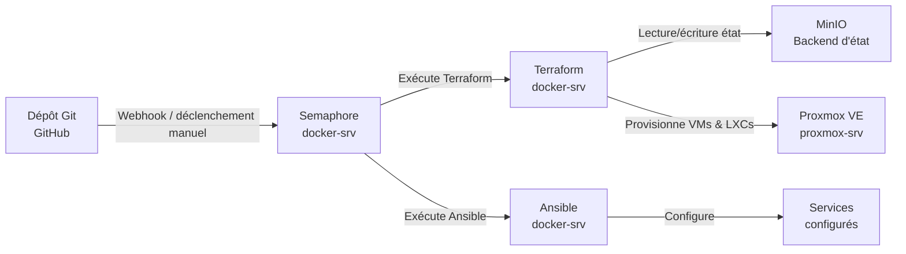

<div style="text-align: right">
  <a href="/en/iac-automation.html">🇬🇧 English</a>
</div>

# IaC & Automatisation

**Résumé technique**
Toute l'infrastructure est définie sous forme de code et exécutée via 
un pipeline automatisé. Terraform provisionne les VMs et LXCs Proxmox 
avec un état stocké dans un backend S3 MinIO auto-hébergé. Ansible 
configure chaque service via des rôles réutilisables, exécutés par 
Semaphore comme plateforme CI/CD auto-hébergée. Aucune infrastructure 
n'est créée ou modifiée manuellement.

---

## Vue d'ensemble du pipeline


---

## Terraform

Terraform provisionne toute l'infrastructure sur Proxmox via le 
provider communautaire `bpg/proxmox`. L'état est stocké dans MinIO, 
un object store compatible S3 auto-hébergé, garantissant la 
persistance de l'état entre les exécutions Semaphore.

### Provider et backend
```hcl
terraform {
  required_version = ">= 1.6.0"

  backend "s3" {
    bucket   = "terraform-state"
    key      = "homelab/terraform.tfstate"
    endpoints = {
      s3 = "http://docker-srv:9000"
    }
    use_path_style              = true
    skip_credentials_validation = true
    skip_metadata_api_check     = true
    skip_region_validation      = true
    skip_requesting_account_id  = true
  }

  required_providers {
    proxmox = {
      source  = "bpg/proxmox"
      version = "0.94.0"
    }
  }
}
```

### Modules réutilisables

Plutôt que de répéter des blocs de ressources, l'infrastructure est 
définie une seule fois sous forme de module, appelé avec des variables 
différentes par instance. Le module LXC WordPress en est un bon 
exemple — une seule définition provisionne les quatre conteneurs :
```hcl
module "richweb" {
  source   = "./modules/wp-lxc"
  hostname = "richweb"
  vmid     = 210
  ip       = "10.20.0.10"
}

module "petitsanglais" {
  source   = "./modules/wp-lxc"
  hostname = "petitsanglais"
  vmid     = 211
  ip       = "10.20.0.11"
}
```

### VM routeur VyOS

La VM VyOS est également entièrement définie dans Terraform avec des 
adresses MAC fixes pour éviter toute reconfiguration réseau lors d'un 
re-apply, et un bloc lifecycle pour préserver les paramètres de 
démarrage après le provisionnement initial.

---

## Ansible

Ansible configure chaque service via des rôles modulaires et 
réutilisables. Les variables sont séparées par domaine dans des 
fichiers group_vars, avec les valeurs sensibles chiffrées via 
Ansible Vault.

### Structure des rôles
```
ansible/
├── group_vars/
│   └── all/
│       ├── domains.yml       # Tous les noms de domaine
│       ├── services.yml      # Définitions des services Docker
│       ├── wp-services.yml   # Définitions des sites WordPress
│       ├── vault.yml         # Secrets chiffrés
│       └── wp-vault.yml      # Secrets WP chiffrés
├── inventories/
│   └── production/
│       └── hosts.yml         # Tous les hôtes gérés
├── playbooks/
│   ├── common.yml
│   ├── router.yml
│   ├── wordpress.yml
│   └── traefik.yml
└── roles/
    ├── common/               # Paquets de base, SSH, utilisateurs
    ├── vyos-router/          # NAT et configuration VLAN VyOS
    ├── wp-fullstack/         # nginx, PHP-FPM, MariaDB, WordPress
    ├── traefik/              # Traefik + config dynamique
    ├── cloudflared/          # Configuration tunnel Cloudflare
    ├── minio/                # Object storage MinIO
    └── monitoring/           # Prometheus, Grafana, Loki
```

### Rôle WordPress

Le rôle WordPress illustre bien le pattern utilisé. Un seul rôle 
configure une stack complète — nginx, PHP-FPM, MariaDB et WordPress — 
piloté entièrement par des variables. Le même rôle s'applique aux 
quatre LXCs WordPress, en utilisant `inventory_hostname` pour 
récupérer la configuration du site concerné :
```yaml
- name: Définir les variables du site
  ansible.builtin.set_fact:
    site: "{{ wordpress_sites[inventory_hostname] }}"
```

### Rôle VyOS

Les équipements réseau sont configurés via la collection `vyos.vyos` 
avec le type de connexion `network_cli`. Le rôle VyOS configure le 
NAT masquerade et les quatre sous-interfaces VLAN de manière 
idempotente.

### Gestion des secrets

Toutes les valeurs sensibles — tokens API, mots de passe de bases de 
données, salts WordPress, identifiants Cloudflare — sont stockées dans 
des fichiers chiffrés par Ansible Vault, commités dans le dépôt Git. 
Semaphore ne détient que le mot de passe du vault comme secret 
d'environnement, jamais les secrets eux-mêmes.

---

## Semaphore

Semaphore est une interface web et API auto-hébergée pour exécuter 
des tâches Ansible et Terraform. Il fournit :

- **Templates de tâches** — exécutions de playbooks prédéfinies avec 
inventaire, identifiants et variables d'environnement associés
- **Piste d'audit** — logs complets de chaque exécution avec horodatage
- **Intégration Vault** — mots de passe vault stockés comme secrets 
Semaphore, injectés à l'exécution
- **Tâches planifiées** — pour les exécutions de maintenance automatisées

| Template | Outil | Objectif |
|----------|-------|----------|
| Provision infrastructure | Terraform | Créer/mettre à jour VMs et LXCs |
| Configure common | Ansible | Configuration de base tous hôtes |
| Configure VyOS router | Ansible | NAT et configuration VLAN |
| Deploy WordPress | Ansible | Stack WordPress complète par site |
| Deploy Traefik | Ansible | Configuration ingress et routage |
| Deploy monitoring | Ansible | Prometheus, Grafana, Loki |

---

## MinIO

MinIO fournit un stockage objet compatible S3 pour l'état Terraform. 
Fonctionnant sur docker-srv, il offre à Terraform un backend d'état 
persistant et versionné sans nécessiter de compte AWS. La même 
instance MinIO pourra être étendue pour stocker des sauvegardes 
applicatives et des artefacts.

---

[← Vue d'ensemble](/fr/infrastructure.html) | 
**[Suivant : Architecture réseau →](/fr/networking.html)**
