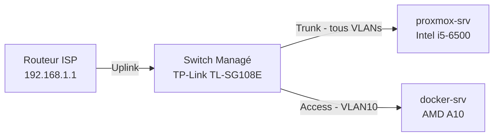
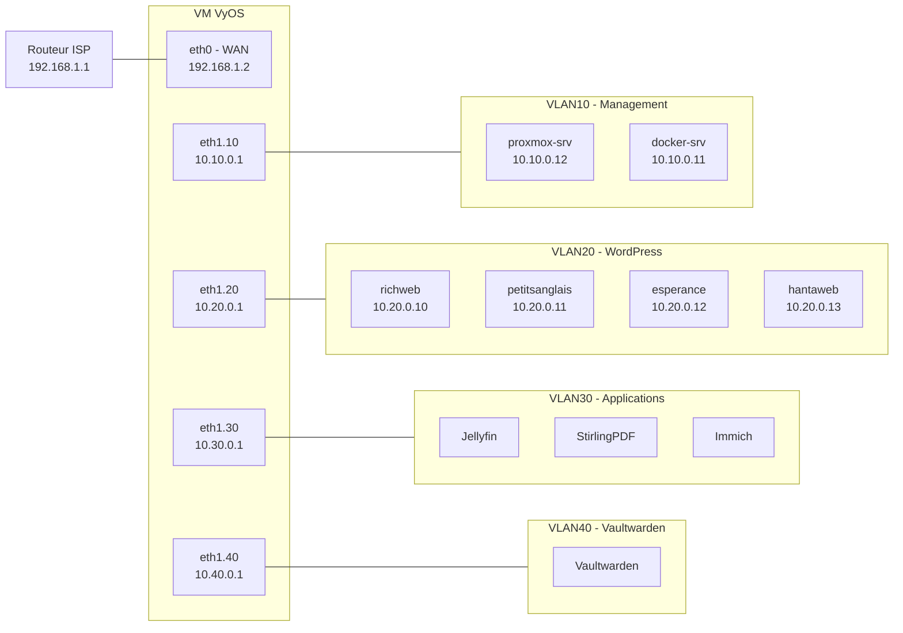
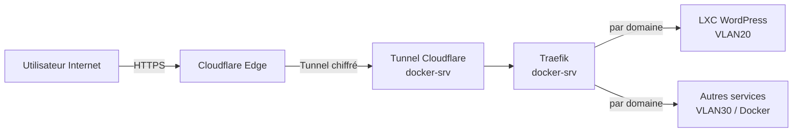

  <a href="/en/infrastructure.html">🇬🇧 English</a>

# Vue d'ensemble de l'infrastructure

**Résumé technique**
Deux serveurs physiques connectés via un switch managé, avec une VM 
VyOS gérant tout le routage interne et la segmentation VLAN. Toute 
l'infrastructure est provisionnée par Terraform et configurée par 
Ansible avec une intervention manuelle minimale.

---

## Architecture physique

| Équipement | Rôle | Connexion |
|------------|------|-----------|
| Routeur ISP | Accès internet + WiFi | — |
| TP-Link TL-SG108E | Switch managé | Uplink vers routeur ISP |
| proxmox-srv | Hôte de virtualisation | Port trunk (tous VLANs) |
| docker-srv | Hôte de conteneurs | Port access (VLAN10) |

---

## Topologie réseau

Le trafic des quatre VLANs est routé par une VM VyOS fonctionnant 
sur proxmox-srv. VyOS gère le routage inter-VLAN et le NAT, en 
présentant une interface WAN unique au routeur ISP.

| VLAN | Sous-réseau | Usage |
|------|-------------|-------|
| VLAN10 | 10.10.0.0/24 | Management — proxmox-srv, docker-srv |
| VLAN20 | 10.20.0.0/24 | WordPress — conteneurs LXC |
| VLAN30 | 10.30.0.0/24 | Applications — Jellyfin, StirlingPDF, Immich |
| VLAN40 | 10.40.0.0/24 | Vaultwarden — gestionnaire de secrets isolé |

---

## Flux de trafic

Tout le trafic externe entre par Cloudflare — aucun port entrant 
n'est ouvert sur le routeur ISP. Le tunnel Cloudflare tourne sur 
docker-srv et transmet le trafic à Traefik, qui route vers le service 
approprié par nom de domaine.

---

## Résumé de la stack complète

| Couche | Technologie | Emplacement |
|--------|-------------|-------------|
| Réseau physique | TP-Link TL-SG108E | Matériel |
| Routage & NAT | VyOS | VM sur proxmox-srv |
| Virtualisation | Proxmox VE | proxmox-srv |
| Conteneurs | Docker | docker-srv |
| Charges LXC | Debian 13 LXCs | proxmox-srv |
| Provisionnement | Terraform | docker-srv (CLI) |
| Configuration | Ansible + Semaphore | docker-srv |
| Backend d'état | MinIO | docker-srv |
| Ingress | Cloudflare Tunnel + Traefik | docker-srv |
| Sécurité | CrowdSec + Bouncer | docker-srv |
| Monitoring | Prometheus + Grafana + Loki | docker-srv |
| Secrets | Ansible Vault | Dépôt Git (chiffré) |

---

*Cette vue d'ensemble reflète l'état actuel du homelab.
Les pages suivantes couvrent chaque couche en détail.*

---

[← Accueil](/fr/index.html) | **[Suivant : IaC & Automatisation →](/fr/iac-automation.html)**
