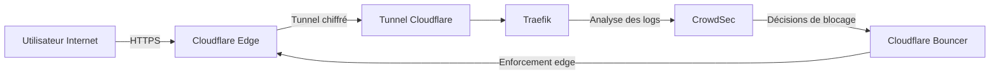
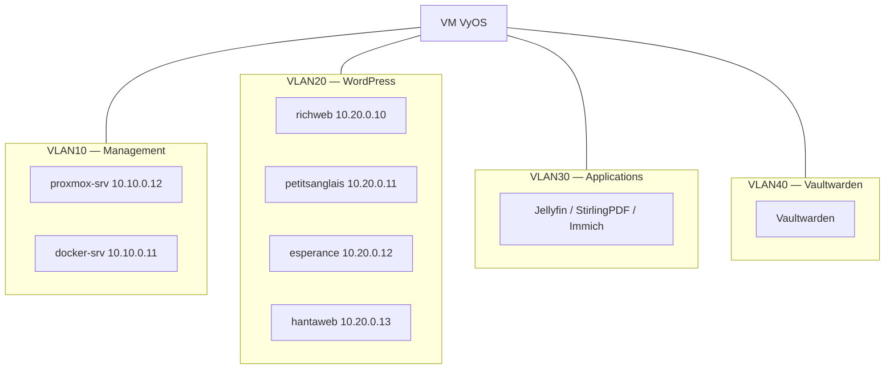

  <a href="/en/networking.html">🇬🇧 English</a>

# Architecture réseau

**Résumé technique**
Une VM VyOS gère tout le routage interne et le NAT entre quatre VLANs 
isolés. Le trafic externe entre exclusivement via un tunnel Cloudflare — 
aucun port entrant n'est ouvert sur le routeur ISP.

---

## Ingress zero-trust

Aucun port n'est forwardé sur le routeur ISP. L'IP publique du 
homelab n'est jamais exposée. Tout le trafic passe par l'intelligence 
mondiale des menaces de Cloudflare avant d'atteindre le réseau.

---

## Segmentation VLAN

| VLAN | Sous-réseau | Usage |
|------|-------------|-------|
| VLAN10 | 10.10.0.0/24 | Management |
| VLAN20 | 10.20.0.0/24 | LXCs WordPress |
| VLAN30 | 10.30.0.0/24 | Applications |
| VLAN40 | 10.40.0.0/24 | Vaultwarden — isolé |

Les sites WordPress sont le vecteur d'attaque le plus probable — 
code PHP public avec plugins tiers. Les placer sur VLAN20 signifie 
qu'un site compromis ne peut pas atteindre l'infrastructure de 
management ou Vaultwarden sans passer par les règles de pare-feu VyOS.

---

## Switch managé

| Port | Mode | Affectation |
|------|------|-------------|
| Port 1 | Uplink | Routeur ISP (non tagué) |
| Port 2 | Trunk | proxmox-srv (tous VLANs tagués) |
| Port 3 | Access | docker-srv (VLAN10 non tagué) |

---

## Améliorations prévues

- Règles de pare-feu inter-VLAN sur VyOS
- Serveur DHCP par VLAN sur VyOS

---

[← IaC & Automatisation](/fr/iac-automation.html) | 
**[Suivant : Services & Charges de travail →](/fr/services.html)**
