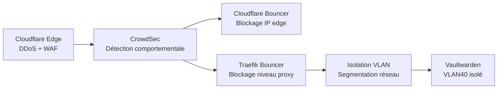

  <a href="/en/security.html">🇬🇧 English</a>

# Sécurité

**Résumé technique**
La sécurité est appliquée en couches — à l'edge réseau, au niveau du 
reverse proxy, et au niveau des segments réseau. Aucune couche n'est 
utilisée exclusivement. Les credentials sensibles sont chiffrés au 
repos et ne sont jamais stockés en clair.

---

## Modèle de menace

| Menace | Mitigation |
|--------|------------|
| Scan de ports externes | Aucun port ouvert — tunnel Cloudflare uniquement |
| DDoS | Absorption par l'edge Cloudflare |
| Brute force / credential stuffing | Détection CrowdSec + blocage edge |
| Plugin WordPress compromis | Isolation VLAN — ne peut pas atteindre le management ou les secrets |
| Exposition de secrets | Chiffrement Ansible Vault — jamais en clair dans le dépôt |
| Mouvement latéral | Routage inter-VLAN soumis à des règles de pare-feu explicites |

---

## Couches de défense

**Couche 1 — Cloudflare edge**
Terminaison TLS, protection DDoS et règles WAF appliquées avant que 
le trafic n'atteigne le homelab.

**Couche 2 — CrowdSec**
Analyse les logs d'accès Traefik pour détecter les menaces 
comportementales. Décisions poussées simultanément vers deux 
bouncers — le bouncer Cloudflare bloque à l'edge, le bouncer 
Traefik bloque au proxy.

**Couche 3 — Segmentation VLAN**
Les services sont isolés par fonction. Une compromission sur VLAN20 
(WordPress) ne peut pas atteindre VLAN10 (management) ou VLAN40 
(Vaultwarden) sans passer par VyOS.

**Couche 4 — Isolation Vaultwarden**
Les données du coffre-fort de mots de passe se trouvent sur le VLAN 
le plus restreint, sans accès latéral depuis les autres segments.

---

## Gestion des secrets

Toutes les valeurs sensibles sont gérées via Ansible Vault :

| Type de secret | Stockage |
|----------------|----------|
| Tokens API | Ansible Vault — vault.yml |
| Mots de passe bases de données | Ansible Vault — wp-vault.yml |
| Salts WordPress | Ansible Vault — wp-vault.yml |
| Credentials Cloudflare | Ansible Vault — vault.yml |
| Mot de passe du vault | Secret d'environnement Semaphore |

Le mot de passe du vault est stocké uniquement dans Semaphore comme 
variable d'environnement, injecté à l'exécution. Il n'est jamais 
écrit sur disque ni commité dans le dépôt. Les fichiers vault 
chiffrés peuvent être committés en toute sécurité dans un dépôt 
Git public.

---

## Améliorations prévues

- Règles de pare-feu inter-VLAN explicites sur VyOS
- Fail2ban ou équivalent sur les LXCs WordPress
- Rôle de durcissement SSH appliqué à tous les hôtes
- Scan de vulnérabilités automatisé régulier

---

[← Services & Charges de travail](/fr/services.html) | 
**[Suivant : Sauvegarde & Reprise →](/fr/backup-strategy.html)**
