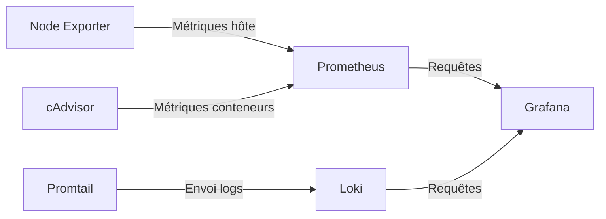

  <a href="/en/services.html">🇬🇧 English</a>

# Services & Charges de travail

**Résumé technique**
Les services sont répartis sur deux hôtes par type de charge. Les 
conteneurs Docker tournent sur docker-srv pour les workloads stateless 
et de monitoring. Les LXCs Proxmox sur proxmox-srv hébergent les sites 
WordPress et les futures applications, chacun isolé dans son propre VLAN.

---

## Carte des services

| Service | Hôte | Type | VLAN |
|---------|------|------|------|
| Traefik | docker-srv | Docker | — |
| Cloudflared | docker-srv | Docker | — |
| CrowdSec | docker-srv | Docker | — |
| Prometheus | docker-srv | Docker | — |
| Grafana | docker-srv | Docker | — |
| Loki + Promtail | docker-srv | Docker | — |
| MinIO | docker-srv | Docker | — |
| Semaphore | docker-srv | Docker | — |
| Vaultwarden | proxmox-srv | LXC | VLAN40 |
| richweb | proxmox-srv | LXC | VLAN20 |
| petitsanglais | proxmox-srv | LXC | VLAN20 |
| esperance | proxmox-srv | LXC | VLAN20 |
| hantaweb | proxmox-srv | LXC | VLAN20 |
| Jellyfin | proxmox-srv | LXC | VLAN30 |
| StirlingPDF | proxmox-srv | LXC | VLAN30 |
| Immich | proxmox-srv | LXC | VLAN30 |

---

## Sites WordPress

Quatre sites WordPress en production, chacun tournant comme un LXC 
Debian 13 indépendant avec une stack complète — nginx, PHP 8.4-FPM 
et MariaDB. Provisionnés par Terraform, configurés par un seul rôle 
Ansible réutilisable.

| Site | Domaine | VLAN |
|------|---------|------|
| richweb | richard.pearsalls.fr | VLAN20 |
| petitsanglais | petitsanglaisabeziers.fr | VLAN20 |
| esperance | egliseesperanceagde.org | VLAN20 |
| hantaweb | hartkenci-elle.com | VLAN20 |

Chaque LXC est totalement isolé — un problème sur un site n'impacte 
pas les autres. Traefik sur docker-srv route vers chaque LXC par 
nom de domaine sur le réseau interne VLAN20.

---

## Stack d'observabilité

Une stack d'observabilité complète tourne sur docker-srv, fournissant 
métriques, logs et dashboards pour tous les services.

| Composant | Usage |
|-----------|-------|
| Prometheus | Collecte et stockage des métriques |
| Node Exporter | Métriques hôte (CPU, RAM, disque) |
| cAdvisor | Métriques par conteneur |
| Grafana | Dashboards et visualisation |
| Loki | Agrégation des logs |
| Promtail | Envoi des logs depuis tous les hôtes |

---

## Vaultwarden

Gestionnaire de mots de passe auto-hébergé compatible Bitwarden. 
Isolé sur VLAN40 — le segment réseau le plus restreint. Accessible 
via Traefik et le tunnel Cloudflare sans exposition directe.

---

## Charges de travail prévues

| Service | Usage | VLAN |
|---------|-------|------|
| Jellyfin | Serveur média | VLAN30 |
| Stack *arr | Acquisition média automatisée | VLAN30 |
| StirlingPDF | Traitement PDF | VLAN30 |
| Immich | Gestion de photos | VLAN30 |

---

[← Architecture réseau](/fr/networking.html) | 
**[Suivant : Sécurité →](/fr/security.html)**
