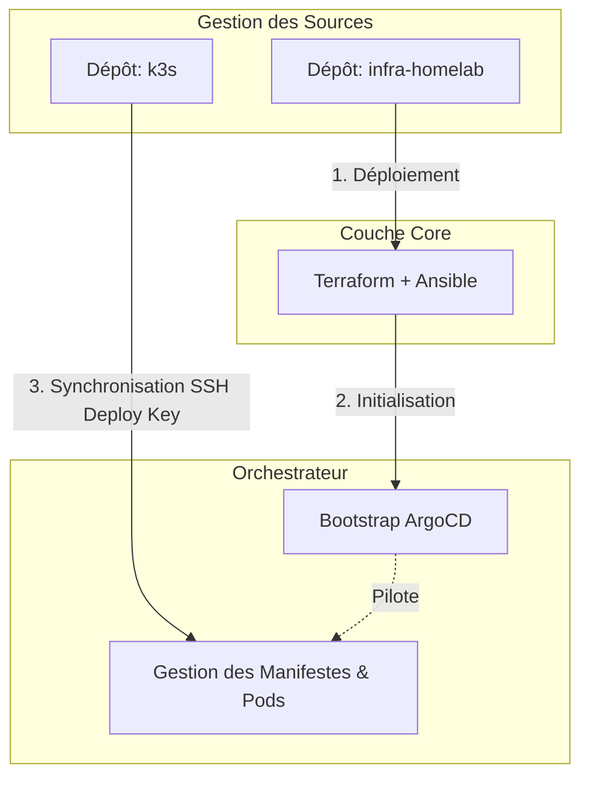
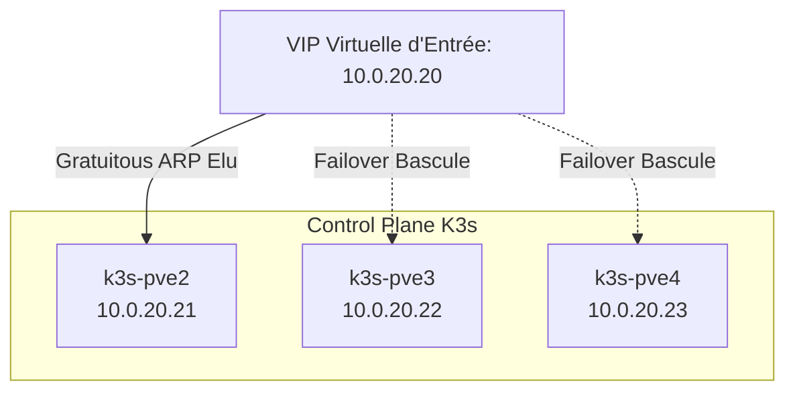

# IaC & Automatisation de l'Infrastructure

Cette page décrit la chaîne de déploiement automatisée de l'infrastructure. L'intégralité du cycle de vie des ressources (du provisionnement matériel au déploiement des applications) est gérée de manière déclarative à travers deux dépôts Git distincts : `infra-homelab` (l'infrastructure de base) et `k3s` (les ressources applicatives).

---

## 🏗️ Architecture des Dépôts Git (Séparation des Responsabilités)

Pour garantir une sécurité et une maintenance optimales, la configuration est séparée en deux frontières étanches :



1. **`infra-homelab`** : Contient le code Terraform (fournisseur Telmate Proxmox) pour déclarer les VMs/LXCs et les playbooks Ansible de configuration OS de base. C'est ici qu'est bootstrappé ArgoCD.
2. **`k3s`** : Dépôt applicatif géré exclusivement en GitOps par ArgoCD. Il contient les CRDs, les charts Helm (Traefik, Calico, Prometheus) et les manifests applicatifs selon le pattern "App of Apps".

---

## 🛠️ Le Workflow de Provisioning en 3 Couches

### 1. Provisioning Infrastructure (Terraform)
Le module Terraform s'interface avec l'API Proxmox VE pour créer les machines virtuelles à partir de templates Cloud-Init (Debian 12). Les clés SSH publiques des administrateurs et la configuration réseau initiale (VLAN, IPs statiques) sont injectées automatiquement lors de la création de la ressource.

### 2. Configuration OS & Sécurité (Ansible)
Une fois les VMs en ligne, Ansible prend le relais pour appliquer les configurations de base :
* Mise à jour du système et installation des paquets indispensables (`curl`, `sudo`, `qemu-guest-agent`).
* Durcissement de la configuration SSH (désactivation de l'authentification par mot de passe, changement de port par défaut).
* Configuration des points de montage disques locaux (`local-lvm`) pour accueillir l'environnement d'exécution du cluster.

### 3. Orchestration Applicative & Moteur GitOps (ArgoCD)
La gestion du cycle de vie des applications n'utilise **aucun outil local ou contrôleur Helm interne décentralisé**. À la place, une mécanique GitOps centralisée via **ArgoCD** pilote l'ensemble du cluster K3s. 

Ansible installe ArgoCD immédiatement après le déploiement du cluster et injecte une clé de déploiement SSH générée à la volée. ArgoCD utilise cette clé pour s'authentifier de manière sécurisée auprès du dépôt privé `k3s`, synchronisant automatiquement l'état désiré des microservices (Calico CNI, Traefik, monitoring, applications).

---

## 📝 Procédure de Déploiement (Bootstrap)

Pour recréer l'infrastructure cible complète à partir de zéro, la suite de commandes suivante est exécutée depuis le nœud d'automation :

```bash
# Étape 1 : Cloner le dépôt d'infrastructure
git clone [https://github.com/richpea1982/infra-homelab.git](https://github.com/richpea1982/infra-homelab.git)
cd infra-homelab/terraform

# Étape 2 : Initialisation et application Terraform
terraform init
terraform plan -out=tfplan
terraform apply tfplan

# Étape 3 : Exécution du Playbook Ansible de base (Configuration OS)
cd ../ansible
ansible-playbook -i inventory.ini site.yml --tags "base,security"

# Étape 4 : Déploiement du cluster K3s (HA Control Plane via Ansible)
ansible-playbook -i inventory.ini playbooks/deploy-k3s.yml

# Étape 5 : Bootstrap de la couche GitOps (ArgoCD)
ansible-playbook -i inventory.ini playbooks/bootstrap-argocd.yml
```

> * Note sur l'étape 4 : Ce playbook initialise le nœud de bootstrap (`2021`), extrait le jeton d'authentification de l'etcd embarqué, puis joint les nœuds `2022` et `2023` pour former le plan de contrôle hautement disponible.
> * Note sur l'étape 5 : Ce playbook déploie l'opérateur ArgoCD, configure le secret SSH contenant la clé de déploiement privée vers le dépôt `richpea1982/k3s`, et applique l'application racine (Root App). À partir de cet instant, ArgoCD prend le contrôle exclusif du cycle de vie de Kubernetes.

---

## 🎯 Architecture Cible : Redondance de l'accès Cluster via `kube-vip`



Dans l'état cible de l'infrastructure, l'accès administratif au cluster (via `kubectl`) ainsi que les requêtes internes de routage ne doivent pas dépendre d'une IP physique unique. 

* **Objectif Technique** : Implémenter une adresse IP virtuelle flottante (`10.0.20.20`) gérée de manière transparente par `kube-vip`.
* **Mécanisme** : `kube-vip` sera déployé directement via les manifests d'auto-déploiement de K3s (`/var/lib/rancher/k3s/server/manifests`). Il utilisons le mode ARP/Gratuitous ARP pour élire un nœud leader parmi le Control Plane. En cas de perte de l'hôte `k3s-pve2`, la VIP basculera instantanément sur `k3s-pve3` ou `k3s-pve4` sans coupure pour le trafic réseau ou le moteur de déploiement continu d'ArgoCD.

---

* **[Suivant : Réseau →](/networking.html)**
* **[← Retour à la Vue d'ensemble](/infrastructure.html)**
---
