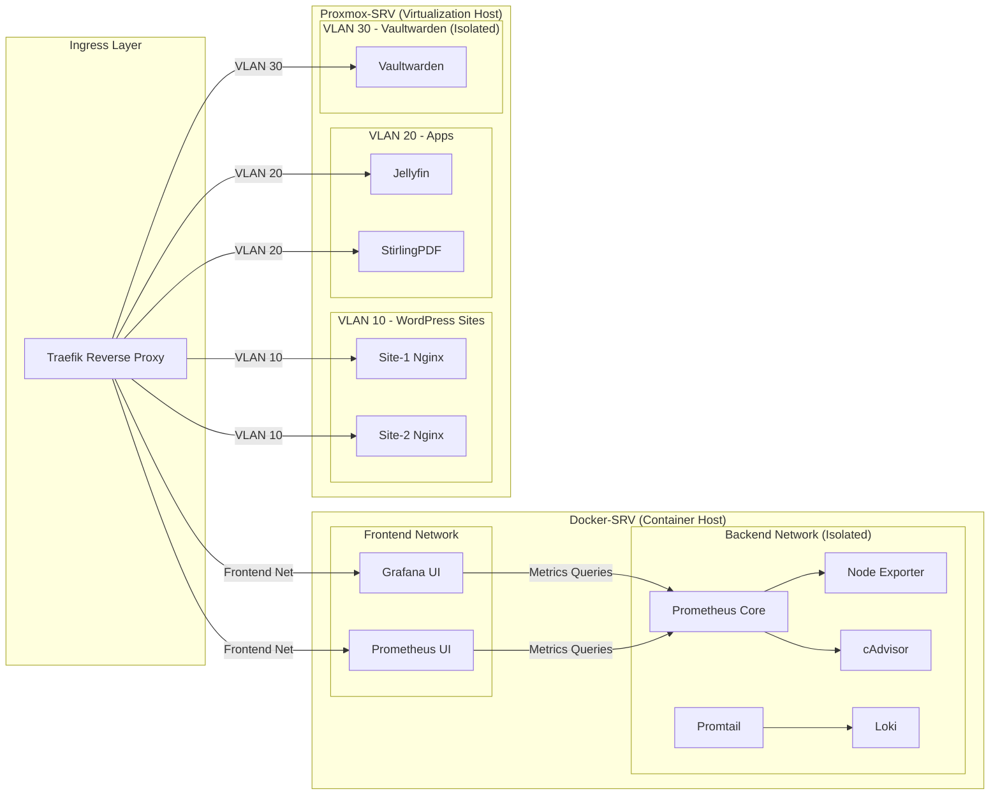

# Internal Networking & Service Isolation
**[github](https://github.com/richpea1982/homelab-infra)**
**Technical summary**  
Services are segmented across two physical hosts—Docker‑SRV and Proxmox‑SRV—using frontend/backend Docker networks and VLANs on Proxmox. Traefik remains the single ingress point, ensuring consistent access control and preventing direct exposure of backend components.

## At a glance
- **Traefik as single ingress** for both Docker and Proxmox workloads.  
- **Docker segmentation:** Frontend network for public UIs; backend network for exporters, logging, and monitoring.  
- **Proxmox segmentation:** VLANs by function (WordPress, Apps, Vaultwarden) to limit lateral movement.  
- **Backend isolation:** Monitoring and system services are internal-only and not reachable from the public internet.

## Diagram explanation
1. **Traefik receives inbound requests.** It routes only to frontend networks or VLANs that are explicitly allowed.  
2. **Docker‑SRV Frontend network.** Hosts UIs such as Grafana and Prometheus UI that Traefik can reach.  
3. **Docker‑SRV Backend network.** Hosts Prometheus core, node exporters, cAdvisor, Loki, and Promtail; these are isolated from Traefik and the public internet.  
4. **Proxmox‑SRV VLANs.** VLAN 10 for WordPress sites; VLAN 20 for general apps (Jellyfin, StirlingPDF); VLAN 30 for Vaultwarden (isolated).  
5. **Controlled access.** Frontend UIs query backend services over internal networks only; Traefik never exposes backend endpoints directly.

## Operational notes
- **Network policy:** Enforce strict firewall rules between VLANs and Docker networks; allow only necessary ports and protocols.  
- **Least privilege routing:** Only allow Traefik to reach frontend containers; use mTLS or service accounts for backend communication where feasible.  
- **Secrets handling:** Keep Vaultwarden on an isolated VLAN; never store backup keys on public networks.  
- **Testing:** Periodically verify backend services are unreachable from the public internet and validate Traefik routing rules.

## Benefits summary
- Reduces blast radius by isolating services by function.  
- Keeps monitoring and logging systems internal and protected.  
- Provides a clear, auditable ingress and access path.

**[Next page](https://richpea1982.github.io/backup-strategy.html)** | **[Home](https://richpea1982.github.io/index.html)** | **[github](https://github.com/richpea1982/homelab-infra)**
