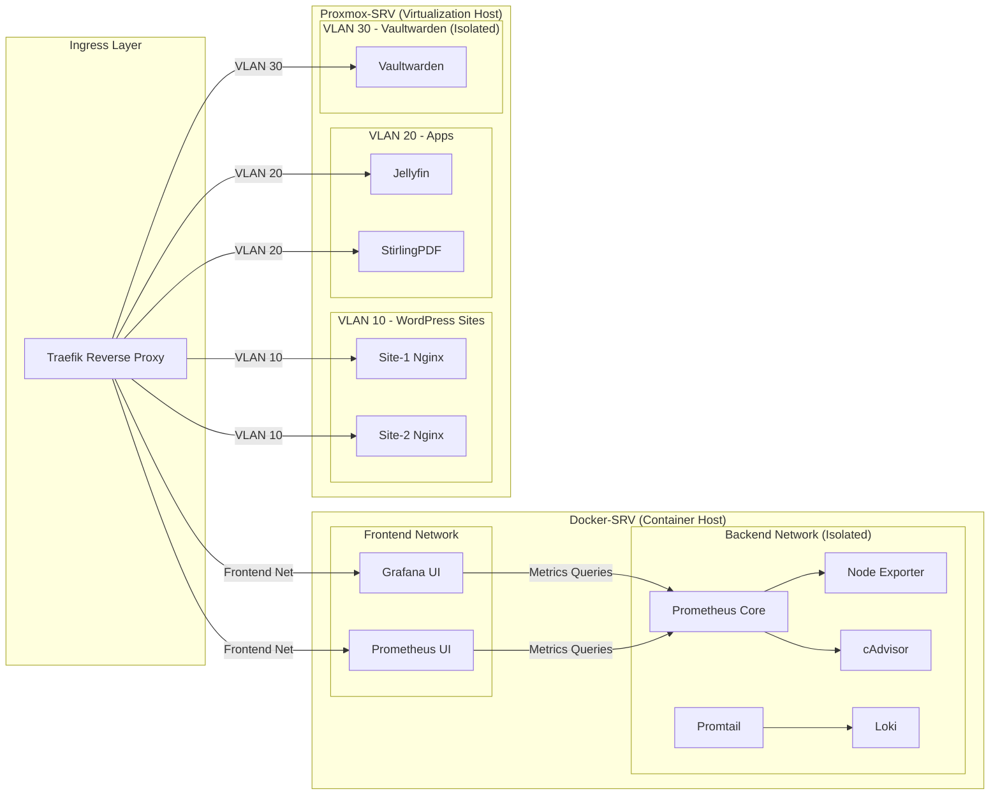

# Internal Networking & Service Isolation

This section provides a high‑level overview of how internal services are segmented across the homelab. The goal is to ensure that applications remain isolated, backend components are never exposed, and each environment is separated by clear network boundaries. This structure reduces the blast radius of any compromise and keeps critical services protected.

---

## Network Segmentation Overview

All traffic entering the homelab is routed through Traefik, which acts as the single ingress point. From there, services are divided across two physical hosts—Docker‑SRV and Proxmox‑SRV—each with their own internal isolation model. Docker services are separated into frontend and backend networks, while Proxmox workloads are segmented by VLANs. This ensures that only intended interfaces are reachable and that sensitive systems remain isolated.

---

## Docker Service Isolation

Docker‑SRV uses two internal networks to separate public‑facing interfaces from backend components. Only frontend services are reachable through Traefik, while backend systems such as exporters, log processors, and monitoring cores remain fully isolated. This ensures that internal data pipelines and system‑level metrics are never exposed externally.

---

## Proxmox VLAN Segmentation

Proxmox‑SRV uses VLANs to isolate workloads by function. WordPress sites, general applications, and Vaultwarden each operate on their own dedicated VLAN. This prevents lateral movement between services and ensures that sensitive applications remain isolated from less trusted workloads.

---

## Controlled Access Through Traefik

All internal services—whether running on Docker or Proxmox—are accessed exclusively through Traefik. This enforces a consistent security boundary and ensures that only approved interfaces are reachable. Backend components and isolated VLANs remain inaccessible unless explicitly routed.

