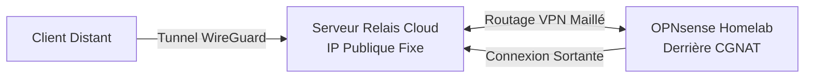

# Architecture réseau

Cette page détaille la topologie réseau logique, les politiques de filtrage inter-VLAN et la stratégie de connectivité sécurisée implémentées pour isoler et protéger mon environnement.

---

## Philosophie Réseau & Segmentation

Le réseau du homelab est entièrement articulé autour d'une approche **Zero-Trust** et d'une micro-segmentation stricte. L'infrastructure élimine les zones de confiance implicites : tout trafic traversant le pare-feu virtualisé **OPNsense** est bloqué par défaut (politique *Default Drop*) et doit faire l'objet d'une règle d'autorisation explicite.

---

## Plan de Micro-Segmentation (VLANs)

L'intégralité du trafic réseau est segmentée en VLANs distincts (802.1Q) afin d'isoler les plans de contrôle, les charges utiles et les flux multimédias :

| VLAN ID | Nom du Réseau | Plage IP (CIDR) | Description / Usage Target |
| :--- | :--- | :--- | :--- |
| **VLAN 10** | `MGMT_BACKBONE` | `10.0.10.0/24` | Interfaces d'administration (Proxmox VE, PBS, NAS, Commutateurs, OPNsense WebGUI). |
| **VLAN 20** | `K3S_CLUSTER` | `10.0.20.0/24` | Trafic d'infrastructure Kubernetes (noeuds K3s, plan de contrôle et communication inter-pod). |
| **VLAN 30** | `INTERNAL_SERVICES` | `10.0.30.0/24` | Conteneurs et VMs applicatifs internes n'ayant pas besoin d'exposition publique (Jellyfin, Photoprism). |
| **VLAN 40** | `DMZ_PUBLIC` | `10.0.40.0/24` | Zone démilitarisée hébergeant les frontaux Web exposés publiquement (WordPress `hantaweb` et `petitsanglais`). |
| **VLAN 50** | `untrusted` | `10.0.50.0/24` | Vlan dédié à des machines sans accès à mon homelab. |

---

## Configuration & Règles OPNsense

L'instance **OPNsense** s'exécute virtualisée sur le nœud `pve1` hors-cluster. Elle gère l'ensemble du routage inter-VLAN et applique les politiques de sécurité à l'aide de l'intégration WireGuard.

### 1. Politiques de Filtrage Majeures (Firewall Matrix)
- **VLAN 10 (MGMT) → Tous les VLANs :** Autorisé de manière bidirectionnelle. C'est la seule zone capable d'initier des sessions SSH ou d'accéder aux API d'administration de n'importe quel autre réseau.
- **VLAN 20 (K3s) → VLAN 10 (NAS / S3) :** Autorisé uniquement vers l'IP spécifique du NAS sur les ports de stockage `9000` (MinIO API) et `9001` (Console) pour la persistance et l'accès au state Terraform. Tout autre accès vers le VLAN 10 est rejeté.
- **VLAN 40 (DMZ) → Réseau Interne :** Blocage absolu (*Strict Drop*). Si un site WordPress de la DMZ venait à être compromis, l'attaquant reste confiné dans le VLAN 40 et ne peut initier aucune connexion vers le cluster K3s, les bases de données internes ou les interfaces de gestion.
- **Politique Internet (WAN Egress) :** Tous les VLANs disposent d'un accès sortant vers l'Internet public (NAT) limité aux ports standards (`80`, `443`, `53`) pour la récupération des mises à jour logicielles et des chartes Helm.

### 2. Implémentation WireGuard (Alternative FOSS & Souveraine)
En conformité avec une philosophie axée sur le logiciel libre (*FOSS*) et l'auto-hébergement prioritaire (*Self-hosted first*), l'infrastructure utilise **WireGuard** comme solution de remplacement direct (*drop-in replacement*) à la solution propriétaire Tailscale.



- **Contournement du CGNAT :** La connexion Internet domestique de mon opérateur (ISP) utilise un mécanisme de CGNAT (Carrier-Grade NAT), privant le routeur local d'une adresse IP publique routable. Pour résoudre cette contrainte sans dépendre d'un orchestrateur tiers SaaS, OPNsense établit une connexion sortante persistante vers un **serveur cloud externe (VPS)** doté d'une IP publique fixe qui fait office de point de rendez-vous et de relais (*Bounce Server*).
- **Assignation d'Interface & Règles :** L'interface virtuelle WireGuard est directement mappée dans OPNsense. Une règle de filtrage stricte appliquée sur cet onglet inspecte le trafic réseau maillé en provenance du relais cloud et autorise exclusivement les flux d'administration authentifiés à destination des ressources sensibles du VLAN 10 et du VLAN 20.

---

## Flux Ingress & Stratégie Zero-Trust

Aucun port n'est ouvert ou redirigé (pas de *Port Forwarding*) sur mon adresse IP publique WAN domestique. L'exposition des services s'effectue via deux canaux hermétiques :

### 1. Flux Entrants Publics (Cloudflare Tunnels)
Pour les sites de production externes accessibles par leur nom de domaine :
- Un démon léger `cloudflared` s'exécute au sein du cluster Kubernetes.
- Ce démon établit une connexion sortante persistante et chiffrée vers les serveurs de bordure Cloudflare.
- Le trafic HTTP/HTTPS mondial frappe Cloudflare, y subit une inspection de sécurité (WAF, protection DDoS), puis est encapsulé dans le tunnel jusqu'à mon contrôleur d'ingress **Traefik v3**.

### 2. Flux Entrants Administratifs (Réseau Maillé WireGuard)
Pour l'accès technique nomade (accès aux dashboards Proxmox, portails de logs Dozzle, instances Grafana) :
- L'administrateur active son client WireGuard, configuré pour joindre le serveur relais cloud public.
- Le trafic traverse le tunnel chiffré de bout en bout, transitant par le relais cloud avant d'être acheminé vers la passerelle OPNsense via la connexion persistante (passant ainsi au travers du CGNAT).
- OPNsense applique les règles de pare-feu de l'interface WireGuard pour valider et guider de manière sécurisée l'administrateur vers les adresses IP privées du backbone de gestion.

---

## Protection au Niveau Application (Layer 7)

Au-delà du filtrage par paquets opéré par OPNsense, la sécurité réseau est renforcée au plus près des applications :
- **Calico CNI (Network Policies) :** Au sein de Kubernetes, Calico applique des règles d'isolation micro-spécifiques. Par exemple, le pod du tunnel Cloudflare est explicitement interdit de communiquer avec un autre pod que celui du Portfolio Markdown, bloquant tout mouvement latéral au sein du cluster.
- **Integration CrowdSec :** Traefik v3 analyse les requêtes HTTP entrantes en temps réel. Les bouncers CrowdSec locaux interrogent l'agent d'analyse de logs pour bloquer instantanément (via des listes de blocage distribuées ou des détections comportementales) les requêtes malveillantes ou les tentatives de scan agressives directement à la frontière du cluster.

---

* **[Suivant : Services & Applications →](/services.html)**
* **[← Accueil](/index.html)**
---
```
