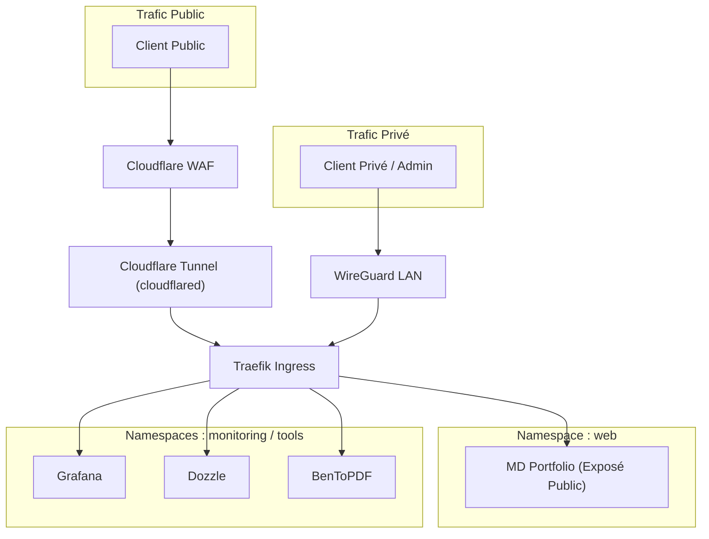

# Services & Charges de travail

Cette page détaille l'architecture logique des applications, la topologie du cluster Kubernetes (K3s), les mécanismes de routage de couche 7 (Ingress) ainsi que la gestion de la persistance et du stockage des données du homelab.

L'ensemble des déploiements décrits ici est orchestré de manière déclarative via notre dépôt Git, constituant la source unique de vérité.

---

## Architecture des Charges de Travail

Le homelab sépare strictement l'exécution des services selon leur état opérationnel (*stateful* vs *stateless*), leurs besoins en ressources et leur adhérence avec le stockage physique :

### 1. Services Hors-Cluster (Proxmox LXC/VM)
Les applications gourmandes en calcul ou nécessitant un accès de stockage massif non-cloud-native sont isolées en dehors de Kubernetes afin de maximiser les performances :

- **`Jellyfin` (LXC 2010, pve2, VLAN 30)** : Serveur multimédia bénéficiant d'un accès direct aux ressources de calcul de `pve2`. Son conteneur est installé sur le stockage local-lvm.
- **`Photoprism` (LXC 2011, pve2, VLAN 30)** : Base de données et indexation de photos, installée de manière similaire sur `pve2`.

- **VMs de Production WordPress (VLAN 40)** : Deux instances critiques s'exécutent en Haute Disponibilité (HA) grâce au stockage distribué Ceph :
  - **`hantaweb` (VM 4011, pve3 HA)** : Instance e-commerce WooCommerce de production (2 Cœurs CPU, 4 Go RAM).
  - **`petitsanglais` (VM 4012, pve4 HA)** : Site vitrine de production (1 Cœur CPU, 1 Go RAM).

### 2. Services Orchestrés (Cluster K3s)
Le cluster Kubernetes hautement disponible s'étend sur trois nœuds virtuels dédiés (`k3s-pve2`, `k3s-pve3`, `k3s-pve4`) situés sur le **VLAN 20**.  
K3s gère sa propre haute disponibilité interne pour l'ensemble des microservices et outils qu'il héberge.

---

## Cartographie des Espaces de Noms K3s (Namespaces)

L'organisation interne du cluster s'articule autour de frontières logiques étanches sécurisées par des politiques réseau strictes (Calico) :

| Service / App | Namespace | Exposé via | Domaine / URL d'accès | Sécurité Réseau (Calico Policy) | Stockage (PV/PVC) |
| :--- | :--- | :--- | :--- | :--- | :--- |
| **CF Tunnel** | `networking` | Cloudflare Daemon | `richard.pearsalls.fr` | Autorisé à communiquer uniquement avec le pod Portfolio | Aucun |
| **Traefik** | `kube-system` | Réseau Local / WG | *Routage Interne* | Contrôle global du routeur d'ingress | Aucun (Apatride) |
| **Prometheus** | `monitoring` | Ingress Traefik | *Interne uniquement* | Isolé ; sortie uniquement pour la collecte de métriques | `prometheus-pvc` |
| **Grafana** | `monitoring` | Traefik → WG Local | `grafana.local.lan` | Restreint aux IPs admins authentifiées | `grafana-pvc` |
| **Dozzle** | `monitoring` | Traefik → WG Local | `logs.local.lan` | Restreint au namespace de monitoring | Aucun |
| **BenToPDF** | `tools` | Traefik → WG Local | `pdf.local.lan` | Backend isolé | `bento-pvc` |
| **MD Portfolio** | `web` | CF Tunnel → Traefik | `richard.pearsalls.fr` | Ingress depuis CF autorisé ; egress refusé | `portfolio-assets` |

---

## Routage de Couche 7 & Flux Réseau

L'aiguillage du trafic vers le cluster est segmenté selon la sensibilité des applications :

1. **Exposition Publique (Zéro-Trust)** : Le service `MD Portfolio` est le seul point d'entrée public. Le démon `cloudflared` (sans stockage, namespace `networking`) établit une connexion sortante sécurisée vers Cloudflare. Les règles de sécurité réseau interdisent au tunnel de communiquer avec un autre pod que celui du portfolio.

2. **Routage Interne / Administration** : Les outils d'infrastructure (`Grafana`, `Dozzle`, `BenToPDF`) transitent par l'Ingress **Traefik**. Ils utilisent des domaines en `.local.lan` et leur accès est filtré au niveau de la couche réseau (Calico / OPNsense) pour n'autoriser que les adresses IP d'administration authentifiées (via réseau local ou VPN WireGuard).

---

## Cycle de Vie des Données & Stratégie de Stockage

La persistance des données au sein du homelab est construite sur trois niveaux de criticité et d'infrastructure :

### 1. Persistance Kubernetes (PV/PVC local-lvm)
Pour les services orchestrés dans K3s, la persistance s'appuie sur le stockage rapide `local-lvm` de chaque nœud physique (`pve2`, `pve3`, `pve4`).  
Le cycle de vie est directement lié à l'application via les *PersistentVolumeClaims* (ex: rétention des métriques dans `prometheus-pvc`, configuration de `grafana-pvc`, génération de documents dans `bento-pvc`).

### 2. Haute Disponibilité Distribuée (Ceph)
Les machines virtuelles de production WordPress (`hantaweb` et `petitsanglais`) ainsi que les racines des conteneurs LXC multimédias exploitent le cluster **Ceph partagé**.  
Grâce à un facteur de réplication de `3 min 2` distribué sur `pve2/pve3/pve4`, n'importe quel nœud de calcul peut tomber en panne sans provoquer d'interruption de service ou de perte de données sur ces disques systèmes.

### 3. Stockage de Masse Massif (NAS ZFS & MinIO)
Le **NAS Bare-Metal** constitue le cœur de la persistance des données volumineuses du homelab.  
Configuré sous Debian avec un groupe **ZFS RAID-Z2 (6 × 1 TB)**, il offre une double tolérance à la panne de disques.

- **Partages Réseau** : Utilisés directement par `Jellyfin` et `Photoprism` pour stocker les bibliothèques de médias et de photos.  
- **Stockage d'Objets S3** : Exposition d'un endpoint canonicalisé via **MinIO** pour la gestion des sauvegardes et le stockage d'objets cloud-native.

---

[← Accueil](/index.md)
